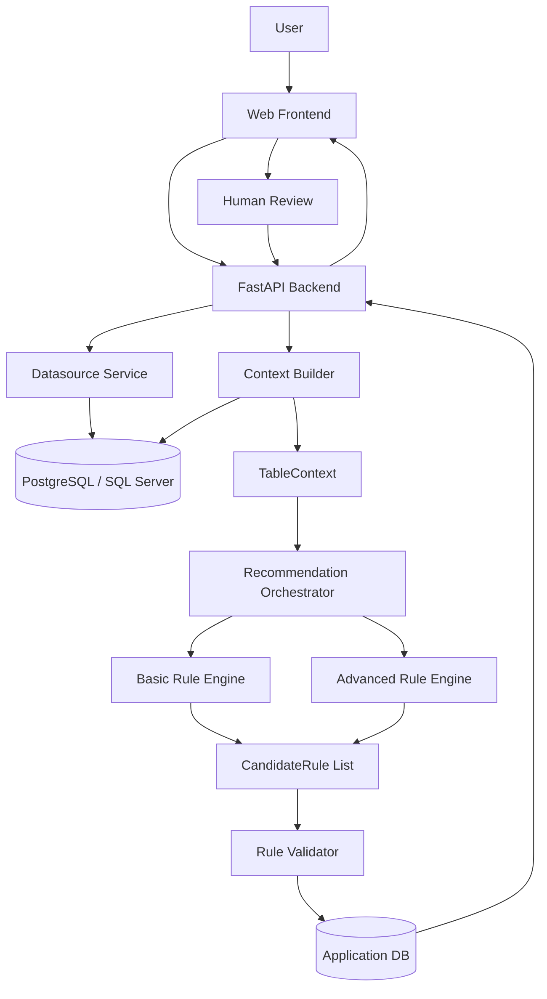
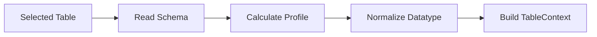
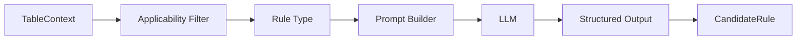
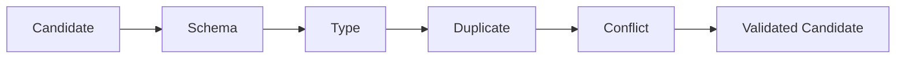
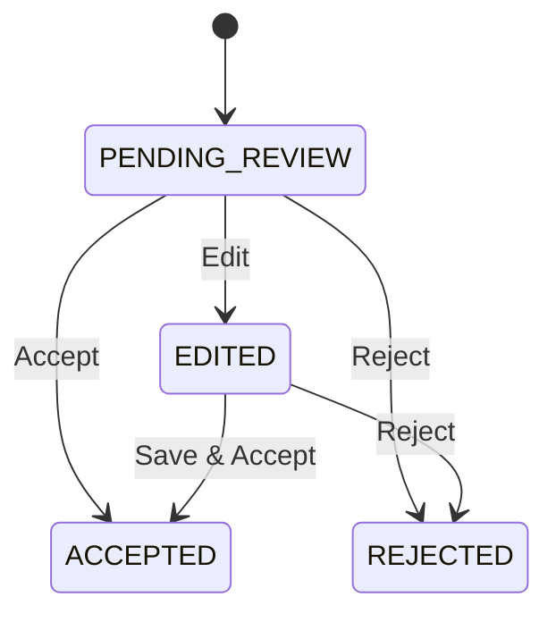
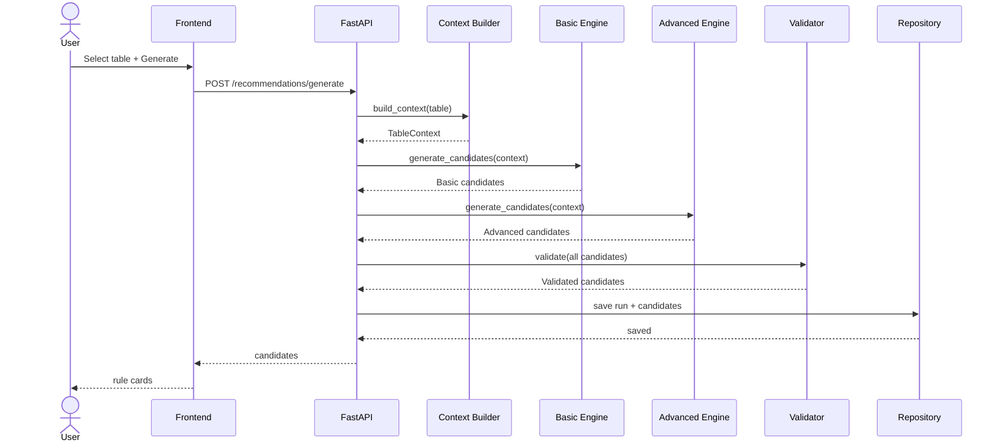
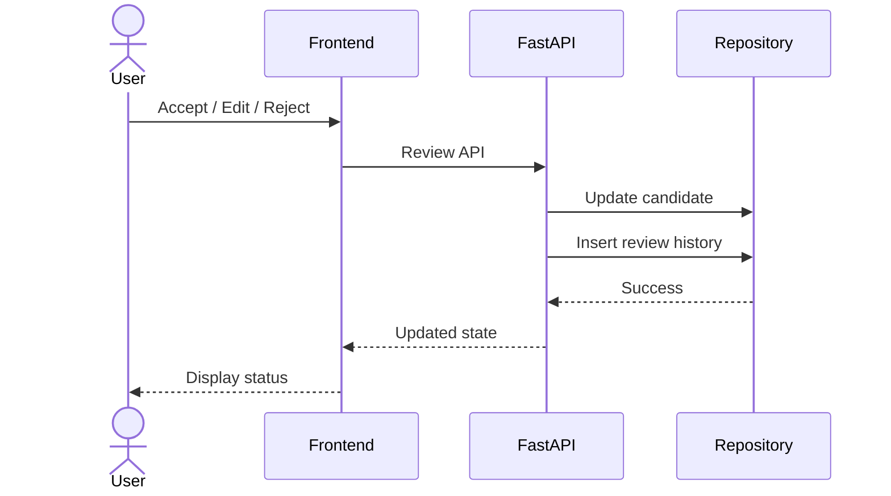
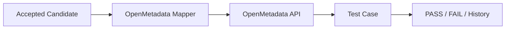

# LOW-LEVEL DESIGN (LLD)
## Data Quality Rule Recommender

**Version:** 1.0  
**Date:** 30/09/2026  
**Scope:** Independent POC Web Application  
**Implementation window:** 30/09/2026 – 18/10/2026

---

# 1. Mục đích

Tài liệu này mô tả thiết kế kỹ thuật chi tiết để hai thành viên có thể bắt đầu code sản phẩm **Data Quality Rule Recommender** theo cùng một contract, hạn chế việc tự suy đoán khi triển khai.

LLD tập trung vào:

- module và trách nhiệm;
- cấu trúc codebase;
- data contract;
- API;
- Basic Rule Engine;
- Advanced Rule Engine;
- Rule Validator;
- Human Review;
- database;
- testing;
- Definition of Done.

> **Quyết định sản phẩm hiện tại:** POC là **Web Application mới, có frontend và backend riêng**.  
> **OpenMetadata integration không nằm trong core POC hiện tại**; đây là hướng phát triển sau.

---

# 2. Phạm vi POC

Người dùng cần thực hiện được luồng:

```text
Chọn datasource/table
        ↓
Xem schema + profiling
        ↓
Generate Recommendations
        ↓
Basic Rules + Advanced Rules
        ↓
Validation
        ↓
Xem Reason + Evidence
        ↓
Accept / Edit / Reject
        ↓
Lưu lịch sử review
        ↓
Evaluation summary
```

## 2.1. Trong phạm vi

- PostgreSQL datasource.
- SQL Server nếu còn đủ thời gian.
- Table/column schema.
- Profiling cơ bản.
- Basic Rule Engine.
- Advanced Rule Engine sử dụng LLM.
- Rule Validator.
- Web UI mới.
- Human Review.
- Lưu recommendation run và review.
- Evaluation cơ bản.

## 2.2. Ngoài phạm vi core POC

- sửa source OpenMetadata;
- nhúng UI vào OpenMetadata;
- publish Test Case sang OpenMetadata;
- fine-tune LLM;
- SSO/production auth;
- cross-table reasoning phức tạp;
- distributed profiling;
- scheduler production.

---

# 3. Kiến trúc tổng thể



---

# 4. Module và trách nhiệm

| Module | Trách nhiệm |
|---|---|
| Frontend | Chọn table, xem profile, xem rule, Accept/Edit/Reject |
| FastAPI | REST API cho Web |
| Datasource Service | Kết nối DB, list database/schema/table |
| Context Builder | Đọc schema, tính profiling, tạo `TableContext` |
| Orchestrator | Gọi engines, merge, validate, persist |
| Basic Rule Engine | Heuristic/statistics-based recommendation |
| Advanced Rule Engine | LLM semantic/cross-column recommendation |
| Rule Validator | Schema/type/dedup/conflict |
| Review Service | Quản lý Accept/Edit/Reject |
| Repository | Lưu run, candidate, review |
| Evaluation Service | Tổng hợp chất lượng recommendation |

---

# 5. Cấu trúc codebase

```text
data-quality-recommender/
├── frontend/
│   ├── src/
│   │   ├── components/
│   │   │   ├── DatasourceSelector.*
│   │   │   ├── TableSelector.*
│   │   │   ├── SchemaTable.*
│   │   │   ├── ProfilingCard.*
│   │   │   ├── RuleCard.*
│   │   │   ├── RuleEditModal.*
│   │   │   └── ValidationBadge.*
│   │   ├── pages/
│   │   │   ├── Home.*
│   │   │   ├── Explore.*
│   │   │   ├── Recommendation.*
│   │   │   ├── ReviewDashboard.*
│   │   │   └── Evaluation.*
│   │   └── services/
│   │       └── api.*
│   └── package.json
│
├── backend/
│   ├── main.py
│   ├── api/
│   │   ├── routes_datasource.py
│   │   ├── routes_context.py
│   │   ├── routes_recommendation.py
│   │   ├── routes_review.py
│   │   └── routes_evaluation.py
│   ├── contracts/
│   │   ├── table_context.py
│   │   ├── candidate_rule.py
│   │   ├── validation.py
│   │   └── review.py
│   ├── datasource/
│   │   ├── base.py
│   │   ├── postgres.py
│   │   └── sqlserver.py
│   ├── profiler/
│   │   ├── context_builder.py
│   │   ├── schema_reader.py
│   │   └── profiler.py
│   ├── engine/
│   │   ├── base.py
│   │   ├── orchestrator.py
│   │   ├── basic_engine.py
│   │   ├── advanced_engine.py
│   │   └── prompts/
│   │       ├── temporal.md
│   │       ├── cross_column.md
│   │       ├── conditional_dependency.md
│   │       └── semantic_format.md
│   ├── validator/
│   │   ├── schema_validator.py
│   │   ├── type_validator.py
│   │   ├── duplicate_validator.py
│   │   └── conflict_validator.py
│   ├── review/
│   │   └── review_service.py
│   ├── evaluation/
│   │   └── evaluation_service.py
│   ├── repository/
│   │   ├── models.py
│   │   ├── recommendation_repository.py
│   │   └── review_repository.py
│   └── config/
│       └── settings.py
│
├── tests/
│   ├── unit/
│   ├── integration/
│   └── e2e/
│
├── data/
│   ├── fixtures/
│   └── evaluation/
│
├── docs/
│   ├── LLD.md
│   ├── RULE_SPEC.md
│   ├── API_SPEC.md
│   └── TEST_PLAN.md
│
├── docker-compose.yml
├── .env.example
└── README.md
```

---

# 6. Data Contract bắt buộc

Hai engine phải dùng chung:

```text
TableContext -> List[CandidateRule]
```

Đây là contract quan trọng nhất của hệ thống.

## 6.1. `ColumnProfile`

```python
class ColumnProfile(BaseModel):
    row_count: int
    null_count: int
    null_ratio: float

    distinct_count: int
    distinct_ratio: float

    min_value: Any | None = None
    max_value: Any | None = None

    min_length: int | None = None
    max_length: int | None = None

    top_values: list[dict] = []
```

Công thức:

```text
null_ratio = null_count / row_count
distinct_ratio = distinct_count / row_count
```

Nếu `row_count = 0`, không thực hiện phép chia trực tiếp.

## 6.2. `ColumnContext`

```python
class ColumnContext(BaseModel):
    name: str
    data_type: str
    nullable: bool
    description: str | None = None

    is_primary_key: bool = False
    is_foreign_key: bool = False

    profile: ColumnProfile
```

## 6.3. `TableContext`

```python
class TableContext(BaseModel):
    datasource_id: str

    database_name: str
    schema_name: str
    table_name: str

    table_description: str | None = None
    row_count: int

    columns: list[ColumnContext]

    existing_rules: list[dict] = []
    business_context: dict | None = None
```

---

# 7. Candidate Rule Model

```python
class CandidateRule(BaseModel):
    id: UUID
    run_id: UUID

    rule_type: str

    level: Literal[
        "TABLE",
        "COLUMN",
        "MULTI_COLUMN"
    ]

    target_table: str
    target_columns: list[str]

    parameters: dict = {}
    expression: str | None = None

    reason: str
    evidence: dict

    source: Literal[
        "BASIC",
        "ADVANCED"
    ]

    confidence: float | None = None

    validation_status: Literal[
        "PENDING",
        "VALID",
        "WARNING",
        "INVALID"
    ]

    validation_messages: list[str] = []

    review_status: Literal[
        "PENDING_REVIEW",
        "ACCEPTED",
        "EDITED",
        "REJECTED"
    ]

    created_at: datetime
```

## 7.1. Ví dụ Basic Candidate

```json
{
  "rule_type": "NOT_NULL",
  "level": "COLUMN",
  "target_table": "customers",
  "target_columns": ["customer_id"],
  "parameters": {},
  "reason": "customer_id không có giá trị null trong dữ liệu profiling.",
  "evidence": {
    "null_count": 0,
    "null_ratio": 0.0,
    "row_count": 10000
  },
  "source": "BASIC",
  "validation_status": "PENDING",
  "review_status": "PENDING_REVIEW"
}
```

## 7.2. Ví dụ Advanced Candidate

```json
{
  "rule_type": "TEMPORAL_CONSTRAINT",
  "level": "MULTI_COLUMN",
  "target_table": "orders",
  "target_columns": ["created_at", "completed_at"],
  "parameters": {},
  "expression": "completed_at >= created_at",
  "reason": "Thời điểm hoàn thành không nên xảy ra trước thời điểm tạo đơn.",
  "evidence": {
    "column_types": {
      "created_at": "DATETIME",
      "completed_at": "DATETIME"
    }
  },
  "source": "ADVANCED",
  "validation_status": "PENDING",
  "review_status": "PENDING_REVIEW"
}
```

---

# 8. Datasource Layer

Interface:

```python
class BaseDatasource(ABC):

    @abstractmethod
    def list_databases(self) -> list[str]:
        pass

    @abstractmethod
    def list_schemas(self, database: str) -> list[str]:
        pass

    @abstractmethod
    def list_tables(
        self,
        database: str,
        schema: str
    ) -> list[str]:
        pass

    @abstractmethod
    def get_columns(self, ...) -> list[dict]:
        pass

    @abstractmethod
    def execute_readonly_query(
        self,
        sql: str
    ) -> list[dict]:
        pass
```

POC ưu tiên:

1. PostgreSQL.
2. SQL Server nếu thời gian cho phép.

---

# 9. Context Builder

Flow:



## 9.1. Profiling tối thiểu

Table-level:

- `row_count`

Column-level:

- `null_count`
- `null_ratio`
- `distinct_count`
- `distinct_ratio`
- `min_value`
- `max_value`
- `min_length`
- `max_length`
- `top_values`

## 9.2. Datatype normalization

```text
varchar / nvarchar / text
    -> STRING

int / bigint / smallint
    -> INTEGER

numeric / decimal / float
    -> NUMBER

date
    -> DATE

timestamp / datetime
    -> DATETIME

boolean / bit
    -> BOOLEAN
```

Engine và Validator chỉ dùng datatype đã normalize.

---

# 10. Base Rule Engine

```python
class BaseRuleEngine(ABC):

    @abstractmethod
    def generate_candidates(
        self,
        context: TableContext
    ) -> list[CandidateRule]:
        pass
```

Basic và Advanced Engine bắt buộc triển khai interface này.

---

# 11. Basic Rule Engine

Nguyên tắc:

- không gọi LLM;
- deterministic;
- dựa trên schema + profiling;
- mọi candidate phải có evidence;
- dữ liệu hiện tại chỉ là bằng chứng thống kê, không tự động được xem là business truth.

## 11.1. NOT NULL

Input:

```text
nullable
null_count
null_ratio
row_count
```

POC heuristic:

```text
IF row_count > 0
AND null_ratio == 0
THEN đề xuất NOT_NULL
```

## 11.2. UNIQUE

Input:

```text
row_count
distinct_count
distinct_ratio
is_primary_key
```

Heuristic:

```text
IF is_primary_key == true
    -> strong candidate

ELSE IF distinct_ratio >= UNIQUE_THRESHOLD
    -> candidate
```

Config ban đầu:

```python
UNIQUE_THRESHOLD = 0.99
```

## 11.3. VALUE BETWEEN

Áp dụng:

```text
INTEGER
NUMBER
DATE
DATETIME
```

Input:

```text
min_value
max_value
```

POC có thể dùng observed min/max làm candidate parameter nhưng evidence phải ghi đây là:

```text
Observed profile boundary
```

không phải business threshold chắc chắn.

## 11.4. VALUES IN SET

Chỉ xét khi cardinality thấp.

Config ban đầu:

```python
MAX_ALLOWED_CARDINALITY = 20
```

Điều kiện:

```text
distinct_count <= MAX_ALLOWED_CARDINALITY
```

Allowed values lấy từ profile.

## 11.5. LENGTH BETWEEN

Áp dụng cho `STRING`.

Input:

```text
min_length
max_length
```

## 11.6. ROW COUNT BETWEEN

Nếu chỉ có một snapshot profile thì chưa có historical baseline đáng tin cậy.

POC nên:

- chưa bật mặc định; hoặc
- sinh với `WARNING`; hoặc
- chỉ bật khi có >= N profile snapshots.

Không tự tạo interval tùy ý từ một lần đo.

---

# 12. Recommendation Orchestrator

Orchestrator không chứa logic rule.

Flow:

```python
def generate(context: TableContext):

    basic = basic_engine.generate_candidates(context)

    advanced = advanced_engine.generate_candidates(context)

    candidates = basic + advanced

    validated = validator.validate_all(
        candidates=candidates,
        context=context
    )

    repository.save(validated)

    return validated
```

---

# 13. Advanced Rule Engine

Advanced Engine chỉ dùng LLM cho phần cần semantic reasoning.

Không sinh lại các Basic Rule như:

- Not Null;
- Unique;
- simple Between;
- low-cardinality In Set.

## 13.1. Rule type POC

Ưu tiên:

1. `TEMPORAL_CONSTRAINT`
2. `CROSS_COLUMN_CONSTRAINT`
3. `CONDITIONAL_DEPENDENCY`
4. `SEMANTIC_FORMAT`

## 13.2. Flow



## 13.3. Applicability Filter

### Temporal

Chỉ gọi nếu có ít nhất 2 cột:

```text
DATE / DATETIME
```

### Conditional Dependency

Ưu tiên khi có:

- status/categorical column;
- cột liên quan có tên hoặc description đủ semantic.

### Cross-column

Chỉ gọi khi có >= 2 cột có khả năng liên quan.

---

# 14. Prompt Contract

Mỗi rule type dùng prompt riêng.

Cấu trúc:

```text
ROLE
RULE TYPE DEFINITION
ALLOWED LOGIC
DISALLOWED LOGIC
TABLE CONTEXT
EXISTING CANDIDATES
OUTPUT JSON SCHEMA
```

Guardrails bắt buộc:

```text
- Chỉ dùng table/column có trong context.
- Không tạo column mới.
- Không tự tạo arbitrary threshold nếu không có evidence.
- Không sinh Basic Rules.
- Nếu không có rule hợp lý, trả [].
- Output phải đúng JSON schema.
```

Ví dụ Temporal:

```text
ROLE:
You are a Data Quality rule recommendation component.

TASK:
Find only temporal relationships between existing columns.

CONTEXT:
{table_context}

CONSTRAINTS:
- Use only existing columns.
- Target columns must have DATE/DATETIME compatible types.
- Do not generate NOT NULL, UNIQUE, BETWEEN or IN SET rules.
- Do not invent thresholds.
- Return [] when evidence is insufficient.

OUTPUT:
JSON array matching LLMCandidateOutput schema.
```

---

# 15. Structured LLM Output

LLM không trả text tự do.

```python
class LLMCandidateOutput(BaseModel):
    rule_type: str
    target_columns: list[str]

    expression: str | None

    reason: str

    evidence_columns: list[str]
```

Backend chịu trách nhiệm map output sang `CandidateRule`.

---

# 16. Rule Validator

Flow:



## 16.1. Schema validation

Kiểm tra:

- target table tồn tại;
- target columns tồn tại;
- expression không dùng column ngoài context.

Column do LLM bịa:

```text
validation_status = INVALID
```

## 16.2. Type validation

Ví dụ:

```text
completed_at >= created_at
```

chỉ hợp lệ với:

```text
DATE / DATETIME
```

Numeric relation chỉ dùng:

```text
INTEGER / NUMBER
```

## 16.3. Duplicate validation

Canonical key gợi ý:

```python
canonical_key = (
    rule_type,
    tuple(sorted(target_columns)),
    normalized_parameters,
    normalized_expression
)
```

Ví dụ Basic và Advanced cùng đề xuất một logic thì chỉ giữ một candidate hợp lệ.

## 16.4. Conflict validation

POC chỉ cần bắt conflict rõ ràng.

Ví dụ:

```text
age BETWEEN 0 AND 100
age BETWEEN 120 AND 200
```

Kết quả:

```text
validation_status = WARNING
```

Không nhất thiết tự reject.

---

# 17. Human Review

State machine:



## 17.1. Cho phép Edit

Basic:

- min;
- max;
- allowed values;
- reason.

Advanced:

- expression;
- parameters;
- reason.

Không cho sửa:

```text
source
run_id
created_at
```

---

# 18. Database Design

POC dùng PostgreSQL làm application storage.

## 18.1. `recommendation_run`

```text
id UUID PK
datasource_id VARCHAR
database_name VARCHAR
schema_name VARCHAR
table_name VARCHAR
started_at TIMESTAMP
finished_at TIMESTAMP
status VARCHAR
```

## 18.2. `candidate_rule`

```text
id UUID PK
run_id UUID FK

rule_type VARCHAR
level VARCHAR

target_table VARCHAR
target_columns JSONB

parameters JSONB
expression TEXT

reason TEXT
evidence JSONB

source VARCHAR
confidence FLOAT NULL

validation_status VARCHAR
validation_messages JSONB

review_status VARCHAR

created_at TIMESTAMP
updated_at TIMESTAMP
```

## 18.3. `rule_review`

```text
id UUID PK
candidate_rule_id UUID FK

action VARCHAR
original_value JSONB
updated_value JSONB

comment TEXT NULL

reviewed_at TIMESTAMP
```

---

# 19. API Design

Base prefix:

```text
/api/v1
```

## 19.1. Datasource

```http
GET /api/v1/datasources
GET /api/v1/datasources/{id}/databases
GET /api/v1/datasources/{id}/databases/{db}/schemas
GET /api/v1/datasources/{id}/databases/{db}/schemas/{schema}/tables
```

## 19.2. Context

```http
GET /api/v1/context
```

Query:

```text
datasource_id
database
schema
table
```

## 19.3. Generate

```http
POST /api/v1/recommendations/generate
```

Request:

```json
{
  "datasource_id": "postgres-local",
  "database": "demo",
  "schema": "public",
  "table": "orders",
  "engines": ["BASIC", "ADVANCED"]
}
```

Response:

```json
{
  "run_id": "uuid",
  "status": "COMPLETED",
  "candidate_count": 8,
  "candidates": []
}
```

## 19.4. Review

Accept:

```http
POST /api/v1/rules/{rule_id}/accept
```

Reject:

```http
POST /api/v1/rules/{rule_id}/reject
```

Edit:

```http
PATCH /api/v1/rules/{rule_id}
```

## 19.5. Evaluation

```http
GET /api/v1/evaluation/summary
```

---

# 20. Frontend Screens

## 20.1. Explore

- datasource selector;
- database selector;
- schema selector;
- table selector;
- `Load Table`.

## 20.2. Table Overview

Hiển thị:

- table name;
- row count;
- columns;
- datatype;
- nullable;
- description;
- profiling metrics.

CTA:

```text
Generate Recommendations
```

## 20.3. Recommendation

Filter:

```text
All
Basic
Advanced
Validated
Warning
Accepted
Rejected
```

Mỗi Rule Card hiển thị:

```text
Rule Type
Target
Expression / Parameters
Reason
Evidence
Source
Validation Status

[Accept] [Edit] [Reject]
```

---

# 21. Sequence Diagram — Generate



---

# 22. Sequence Diagram — Review



---

# 23. Error Handling

## 23.1. Datasource unavailable

```text
HTTP 503
code = DATASOURCE_UNAVAILABLE
```

## 23.2. Profiling lỗi một metric

Không fail toàn bộ context nếu vẫn còn dữ liệu hữu ích.

Metric lỗi được đánh dấu unavailable.

## 23.3. LLM timeout

Basic Engine vẫn trả được kết quả.

Response có warning:

```json
{
  "warnings": [
    "Advanced recommendation unavailable because LLM timed out."
  ]
}
```

## 23.4. Invalid LLM JSON

Retry tối đa 1 lần.

Nếu vẫn invalid:

```text
Advanced Engine = FAILED
```

Không cố parse text tự do.

---

# 24. Configuration

`.env.example`

```env
APP_ENV=development

DATABASE_URL=

POSTGRES_SOURCE_URL=
SQLSERVER_SOURCE_URL=

LLM_PROVIDER=
LLM_API_KEY=
LLM_MODEL=

LLM_TIMEOUT_SECONDS=30

UNIQUE_THRESHOLD=0.99
MAX_ALLOWED_CARDINALITY=20
```

---

# 25. Logging

Mỗi run log:

```text
run_id
table
profiling_duration_ms
basic_engine_duration_ms
advanced_engine_duration_ms
validation_duration_ms

candidate_count_basic
candidate_count_advanced
invalid_candidate_count
```

Không log:

- password;
- API key;
- raw sensitive PII mặc định.

---

# 26. Testing Strategy

## 26.1. Unit test

### Context Builder

- datatype normalization;
- ratio calculation;
- empty table;
- null handling.

### Basic Engine

Mỗi rule có:

```text
positive test
negative test
boundary test
```

### Advanced Engine

Test:

- prompt builder;
- output schema parser;
- malformed JSON;
- empty `[]`;
- hallucinated column bị Validator chặn.

### Validator

- valid column;
- missing column;
- invalid datatype;
- duplicate;
- conflict.

## 26.2. Integration test

```text
Sample DB
    ↓
Context Builder
    ↓
Basic + Mocked Advanced
    ↓
Validator
    ↓
Repository
```

## 26.3. E2E test

```text
1. Open Web
2. Select datasource
3. Select table
4. View profiling
5. Generate
6. See Basic + Advanced
7. Accept one
8. Edit one
9. Reject one
10. Reload
11. Review state vẫn tồn tại
```

---

# 27. Evaluation Metrics

Review:

```text
accept_rate = accepted / total_reviewed
edit_rate   = edited / total_reviewed
reject_rate = rejected / total_reviewed
```

Safety:

```text
invalid_column_rate
duplicate_candidate_rate
type_validation_failure_rate
```

Mục tiêu bắt buộc:

```text
Sau Validator:
invalid_column_rate = 0
```

Tách metric theo:

```text
BASIC
ADVANCED
```

để so sánh:

- số candidate;
- accept rate;
- edit rate;
- reject rate;
- latency.

---

# 28. Definition of Done

Core POC hoàn thành khi:

- [ ] Web chọn được datasource/table.
- [ ] Hiển thị schema.
- [ ] Hiển thị profiling.
- [ ] Context Builder trả đúng `TableContext`.
- [ ] Basic Engine sinh candidate.
- [ ] Advanced Engine sinh structured candidate.
- [ ] Validator chặn column không tồn tại.
- [ ] Validator kiểm tra datatype.
- [ ] Dedup hoạt động.
- [ ] UI hiển thị Reason + Evidence.
- [ ] Accept hoạt động.
- [ ] Edit hoạt động.
- [ ] Reject hoạt động.
- [ ] Review state được lưu.
- [ ] Demo end-to-end chạy được.
- [ ] Có evaluation summary cơ bản.

---

# 29. Quy ước phát triển 2 người

## Thành viên A

Ownership chính:

```text
frontend/
backend/engine/basic_engine.py
backend/api/routes_review.py
```

## Thành viên B

Ownership chính:

```text
backend/profiler/
backend/engine/advanced_engine.py
backend/engine/prompts/
backend/validator/
backend/api/routes_context.py
backend/api/routes_recommendation.py
```

## File/contract chung phải khóa trước

Hai người không bắt đầu triển khai engine trước khi thống nhất:

```text
TableContext
CandidateRule
ValidationStatus
ReviewStatus
BaseRuleEngine
```

Git branch gợi ý:

```text
main
dev
feature/basic-engine
feature/frontend
feature/context-builder
feature/advanced-engine
feature/validator
```

---

# 30. Hướng phát triển sau POC

## 30.1. OpenMetadata Integration

Sau POC mới bổ sung:

```text
backend/integrations/openmetadata/
├── client.py
├── mapper.py
└── publisher.py
```

Flow tương lai:



## 30.2. Semantic Context nâng cao

Bổ sung:

- glossary;
- business terms;
- lineage;
- PK/FK relationships;
- richer descriptions;
- policy;
- historical profile.

## 30.3. Historical Profiling

Dùng nhiều snapshots để hỗ trợ:

- Row Count Between;
- freshness;
- drift;
- stable allowed values;
- threshold đáng tin hơn snapshot đơn lẻ.

## 30.4. Feedback Learning

Tận dụng:

```text
Accept
Edit
Reject
```

để:

- điều chỉnh heuristic;
- refine prompt;
- xây few-shot examples;
- rerank candidates.

---

# 31. Thứ tự triển khai khuyến nghị

```text
1. Lock Data Contracts
        ↓
2. Setup FastAPI + Application DB
        ↓
3. Datasource + Context Builder
        ↓
4. Frontend Skeleton
        ↓
5. Basic Rule Engine
        ↓
6. Advanced Rule Engine
        ↓
7. Rule Validator
        ↓
8. Human Review
        ↓
9. End-to-End Integration
        ↓
10. Evaluation
```

Không nên bắt đầu Advanced LLM trước khi khóa:

```text
TableContext
CandidateRule
Validator contract
```

---

# 32. Tài liệu nên tạo tiếp

Sau LLD:

```text
docs/
├── RULE_SPEC.md
├── API_SPEC.md
├── TEST_PLAN.md
└── EVALUATION_PLAN.md
```

Ưu tiên tiếp theo:

```text
RULE_SPEC.md
```

để khóa chi tiết từng rule:

- input;
- applicability;
- heuristic/prompt;
- parameter;
- evidence;
- validation;
- test cases.

---

# 33. Kết luận

Core POC được thiết kế theo flow:

```text
Datasource
    ↓
Context Builder
    ↓
TableContext
    ↓
Basic Engine + Advanced Engine
    ↓
CandidateRule[]
    ↓
Rule Validator
    ↓
Human Review
    ↓
Evaluation
```

Hai contract trung tâm là:

```text
TableContext
CandidateRule
```

Nhờ đó:

- Basic và Advanced Engine có thể code độc lập;
- Frontend có thể dùng mock data trước;
- Validator không phụ thuộc nguồn sinh candidate;
- OpenMetadata có thể tích hợp sau dưới dạng adapter mà không cần thay đổi core recommendation logic.
