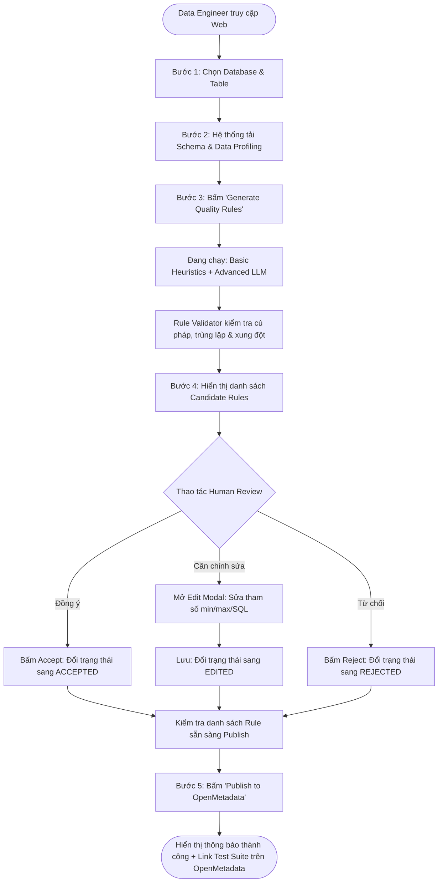

# THIẾT KẾ UI FLOW & WIREFRAME CHO WEB APPLICATION
**Dự án:** Data Quality Rule Recommender (Hệ thống đề xuất Data Quality Rule tự động)  
**Ngày thực hiện:** 30/09/2026 (Hoàn thành công việc Ngày 1 - Sprint 1)  
**Tài liệu căn cứ:** [Báo cáo định nghĩa và kế hoạch xây dựng sản phẩm](file:///D:/VSF/B%C3%A1o_c%C3%A1o_%C4%91%E1%BB%8Bnh_ngh%C4%A9a_v%C3%A0_k%E1%BA%BF_ho%E1%BA%A1ch_x%C3%A2y_d%E1%BB%B1ng_s%E1%BA%A3n_ph%E1%BA%A9m.md)  
**Người thực hiện:** Thành viên A (Frontend & Human Review UI Lead)

---

## 1. TỔNG QUAN KIẾN TRÚC GIAO DIỆN (UI ARCHITECTURE)

Hệ thống được thiết kế theo dạng **Single Page Application (SPA)** với giao diện chia thành 3 khu vực chức năng chính theo đúng User Journey của Data Engineer:

```
┌────────────────────────────────────────────────────────────────────────────────────────────────┐
│  HEADER: Logo DQ-Recommender | Source DB Selector | Connection Status (DB & OpenMetadata)     │
├───────────────────────────────┬────────────────────────────────────────────────────────────────┤
│   BÊN TRÁI: DATA CONTEXT      │   BÊN PHẢI: RULE RECOMMENDATION BOARD & HUMAN REVIEW           │
│                               │                                                                │
│ 1. Chọn Database & Table      │ 1. Thanh trạng thái & Nút kích hoạt [⚡ Generate Rules]       │
│ 2. Schema Viewer (Cột, Type)  │ 2. Bộ lọc (Tất cả, Basic, Advanced, Đã duyệt, Cảnh báo)       │
│ 3. Data Profiling Summary     │ 3. Danh sách thẻ Candidate Rule (Reason, Evidence, Actions)   │
│    (Rows, Nulls, Distinct)    │ 4. Thanh tổng kết & Nút [🚀 Publish to OpenMetadata]           │
└───────────────────────────────┴────────────────────────────────────────────────────────────────┘
```

---

## 2. SƠ ĐỒ LUỒNG NGƯỜI DÙNG (USER JOURNEY FLOW)



---

## 3. THIẾT KẾ CHI TIẾT TỪNG MÀN HÌNH & WIREFRAME

### Màn hình 1: Chọn Data Context & Xem Profiling (Cột trái)
*Mục đích: Cho phép người dùng chọn bảng mục tiêu, xem nhanh cấu trúc Schema và các chỉ số Profiling thống kê trước khi sinh rule.*

```text
┌────────────────────────────────────────────────────────┐
│ 🗄️ DATA CONTEXT EXPLORER                                │
├────────────────────────────────────────────────────────┤
│ Database Source: [ PostgreSQL - Production (v) ]       │
│ Select Table:    [ orders                      (v) ]   │
│                                                        │
│ 📊 Table Profiling Metrics:                            │
│ ┌──────────────────────┬─────────────────────────────┐ │
│ │ Total Rows: 15,420   │ Columns Count: 8            │ │
│ │ Last Profiled: Hôm nay│ Freshness: 10 mins ago      │ │
│ └──────────────────────┴─────────────────────────────┘ │
│                                                        │
│ 📋 Schema & Profiling Summary:                         │
│ ┌──────────────┬──────────┬──────────┬───────────────┐ │
│ │ Column       │ Type     │ Null (%) │ Distinct Count│ │
│ ├──────────────┼──────────┼──────────┼───────────────┤ │
│ │ order_id     │ VARCHAR  │ 0% (0)   │ 15,420 (100%) │ │
│ │ customer_id  │ VARCHAR  │ 0.1% (15)│ 3,210         │ │
│ │ total_amount │ NUMERIC  │ 0% (0)   │ 8,450         │ │
│ │ order_status │ VARCHAR  │ 0% (0)   │ 5             │ │
│ │ created_at   │ TIMESTAMP│ 0% (0)   │ 15,410        │ │
│ │ delivered_at │ TIMESTAMP│ 12% (1.8k│ 13,200        │ │
│ └──────────────┴──────────┴──────────┴───────────────┘ │
└────────────────────────────────────────────────────────┘
```

---

### Màn hình 2: Bảng điều khiển sinh Rule & Thanh công cụ (Toolbar)
*Mục đích: Cung cấp nút bấm kích hoạt bộ máy đề xuất và thanh công cụ lọc/tìm kiếm candidate rules.*

```text
┌──────────────────────────────────────────────────────────────────────────────────────────────┐
│ 🎯 RULE RECOMMENDATION DASHBOARD                                                              │
│ Table: ecommerce_db.orders                                                                   │
├──────────────────────────────────────────────────────────────────────────────────────────────┤
│ [ ⚡ Generate Quality Rules ]   [x] Include Basic (Heuristics)   [x] Include Advanced (LLM)   │
├──────────────────────────────────────────────────────────────────────────────────────────────┤
│ Thống kê nhanh: 6 Candidates đề xuất | [3 Basic] [3 Advanced] | [1 Accepted] [1 Edited]      │
│ Bộ lọc: [ All (6) ]  [ 🟢 Basic (3) ]  [ 🟣 Advanced (3) ]  [ ⚠️ Warning (1) ]  [ Review Done (2) ] │
└──────────────────────────────────────────────────────────────────────────────────────────────┘
```

---

### Màn hình 3: Chi tiết Thẻ Rule (Rule Card Component)
*Mục đích: Hiển thị đầy đủ thông tin của 1 luật đề xuất, minh bạch lý do và số liệu bằng chứng, hỗ trợ thao tác Review tức thì.*

#### Biến thể A: Thẻ Basic Rule (Ví dụ: Range check)
```text
┌──────────────────────────────────────────────────────────────────────────────────────────────┐
│ [ BASIC ]  [ columnValuesToBeBetween ]                       Validation: [ ✅ VALID ]        │
│ Cột mục tiêu: total_amount                                   Confidence: 95%                 │
├──────────────────────────────────────────────────────────────────────────────────────────────┤
│ ⚙️ Tham số cấu hình:                                                                         │
│   • Min Value: 0.0                                                                           │
│   • Max Value: 50,000,000.0 (VND)                                                            │
│                                                                                              │
│ 💡 Lý do đề xuất (Reason):                                                                   │
│   Tổng tiền đơn hàng không thể âm và ngưỡng quan sát thực tế trong dữ liệu là 48.500.000 VNĐ.│
│                                                                                              │
│ 🔍 Bằng chứng dữ liệu (Evidence):                                                            │
│   • Min quan sát: 10,000.0  |  Max quan sát: 48,500,000.0  |  Tổng mẫu kiểm tra: 15,420 dòng │
├──────────────────────────────────────────────────────────────────────────────────────────────┤
│ Trạng thái: [ 🟡 PENDING REVIEW ]                                                             │
│                                     [ ✖ Reject ]   [ ✏️ Edit Parameters ]   [ ✔️ Accept Rule ] │
└──────────────────────────────────────────────────────────────────────────────────────────────┘
```

#### Biến thể B: Thẻ Advanced LLM Rule (Ví dụ: Temporal Cross-Column kèm Cảnh báo)
```text
┌──────────────────────────────────────────────────────────────────────────────────────────────┐
│ [ ADVANCED (LLM) ]  [ tableCustomSQLQuery ]                  Validation: [ ⚠️ WARNING ]      │
│ Cột mục tiêu: created_at, delivered_at                       Confidence: 92%                 │
├──────────────────────────────────────────────────────────────────────────────────────────────┤
│ ⚙️ Biểu thức điều kiện (SQL Expression):                                                     │
│   delivered_at IS NULL OR delivered_at >= created_at                                         │
│                                                                                              │
│ 💡 Lý do đề xuất (Reason):                                                                   │
│   Quy luật thời gian đơn hàng: Thời điểm giao hàng (delivered_at) phải diễn ra sau hoặc      │
│   đồng thời với thời điểm đặt hàng (created_at).                                             │
│                                                                                              │
│ ⚠️ Cảnh báo từ Validator:                                                                    │
│   Phát hiện 2 bản ghi lịch sử vi phạm điều kiện do lỗi nhập tay dữ liệu cũ.                  │
├──────────────────────────────────────────────────────────────────────────────────────────────┤
│ Trạng thái: [ 🟢 ACCEPTED ]                                                                   │
│                                     [ ✖ Reject ]   [ ✏️ Edit Parameters ]   [ Đã duyệt ✔️ ]   │
└──────────────────────────────────────────────────────────────────────────────────────────────┘
```

---

### Màn hình 4: Modal Chỉnh sửa Tham số (Edit Parameter Modal)
*Mục đích: Cho phép Data Engineer tinh chỉnh ngưỡng hoặc câu lệnh SQL trước khi xác nhận đưa vào pipeline.*

```text
┌────────────────────────────────────────────────────────┐
│ ✏️ CHỈNH SỬA THAM SỐ RULE: columnValuesToBeBetween     │
├────────────────────────────────────────────────────────┤
│ Cột mục tiêu: total_amount                             │
│ Gốc đề xuất: Min = 0.0, Max = 50,000,000.0             │
│                                                        │
│ Giá trị Min kỳ vọng:                                   │
│ [ 0.0                                                ] │
│                                                        │
│ Giá trị Max kỳ vọng: (Bạn có thể nâng ngưỡng nghiệp vụ)│
│ [ 100000000.0                                        ] │
│                                                        │
│ Ghi chú điều chỉnh (Tùy chọn):                         │
│ [ Mở rộng hạn mức tối đa cho khách hàng VIP          ] │
├────────────────────────────────────────────────────────┤
│                     [ Hủy bỏ ]    [ Lưu & Duyệt (Save) ]│
└────────────────────────────────────────────────────────┘
```

---

### Màn hình 5: Xuất bản lên OpenMetadata (Publish & Export Layer)
*Mục đích: Tổng kết các rule đã được người dùng xác nhận và kích hoạt API đẩy sang OpenMetadata.*

```text
┌──────────────────────────────────────────────────────────────────────────────────────────────┐
│ 🚀 TỔNG KẾT VÀ XUẤT BẢN TEST SUITE                                                           │
├──────────────────────────────────────────────────────────────────────────────────────────────┤
│ Bảng: orders | Sẵn sàng xuất bản: 4 Rules (2 Not Null/Unique, 1 Range, 1 Temporal SQL)       │
│ Bị từ chối (Rejected): 1 Rule | Còn chờ duyệt: 1 Rule                                        │
│                                                                                              │
│ [ 🚀 Publish to OpenMetadata ]                                                               │
│                                                                                              │
│ (Khi bấm Publish thành công):                                                                │
│ ✅ Đã tạo thành công Test Suite cho bảng 'orders' trên OpenMetadata!                         │
│ 🔗 Xem chi tiết trên OpenMetadata: https://openmetadata.mycompany.com/table/orders/quality   │
└──────────────────────────────────────────────────────────────────────────────────────────────┘
```

---

## 4. QUẢN LÝ TRẠNG THÁI GIAO DIỆN (UI STATES & EDGE CASES)

1. **Trạng thái chưa chọn bảng (Initial / Empty State):**
   - Khu vực bên phải hiển thị hình minh họa và hướng dẫn: *"Vui lòng chọn Database và Bảng ở cột bên trái để bắt đầu phân tích"*.
2. **Trạng thái đang phân tích & sinh Rule (Loading State):**
   - Nút `[ Generate ]` chuyển sang trạng thái Disable kèm Spinner.
   - Hiển thị Skeleton loading và dòng chữ thông báo tiến trình:
     - *"Đang đọc thông tin Schema và Profiling..."*
     - *"Đang suy luận Heuristic Rules cơ bản..."*
     - *"Đang kích hoạt LLM phân tích quan hệ ngữ nghĩa đa cột..."*
     - *"Đang thẩm định tính hợp lệ của rules..."*
3. **Trạng thái cảnh báo của Rule Validator (Warning State):**
   - Nếu phát hiện 2 rule xung đột (ví dụ: một rule chặn `max = 50`, một rule khác cho phép giá trị `100`), thẻ rule sẽ hiển thị viền vàng cam kèm thông báo chi tiết để Data Engineer cân nhắc khi duyệt.
4. **Trạng thái phản hồi tương tác tức thì (Optimistic UI):**
   - Khi bấm **Accept**, thẻ rule lập tức đổi màu viền xanh lá, cập nhật bộ đếm trên thanh thống kê mà không bị giật trang.

---

## 5. HƯỚNG DẪN TRIỂN KHAI CHO NGÀY 01-02/10 (TIẾP THEO)

Vào Ngày 01-02/10, bạn (Thành viên A) sẽ hiện thực hóa thiết kế này thành code:
1. **Khởi tạo thư mục `frontend/`:** Dùng HTML/CSS/JS thuần hoặc React/Vite.
2. **Nạp dữ liệu mẫu:** Sử dụng trực tiếp file [mock_candidate_rules.json](file:///D:/VSF/contracts/mock_candidate_rules.json) đã tạo sẵn ở Bước 1 làm state ban đầu.
3. **Xây dựng theo thứ tự component:**
   - `Header.jsx / Header.html`: Thanh điều hướng và logo.
   - `TableContextPanel`: Cột trái hiển thị bảng schema & profiling.
   - `RuleCard`: Component thẻ hiển thị rule kèm nút bấm Accept/Edit/Reject.
   - `EditModal`: Popup chỉnh sửa tham số.
   - `PublishBanner`: Nút bấm tổng kết và gửi OpenMetadata.
