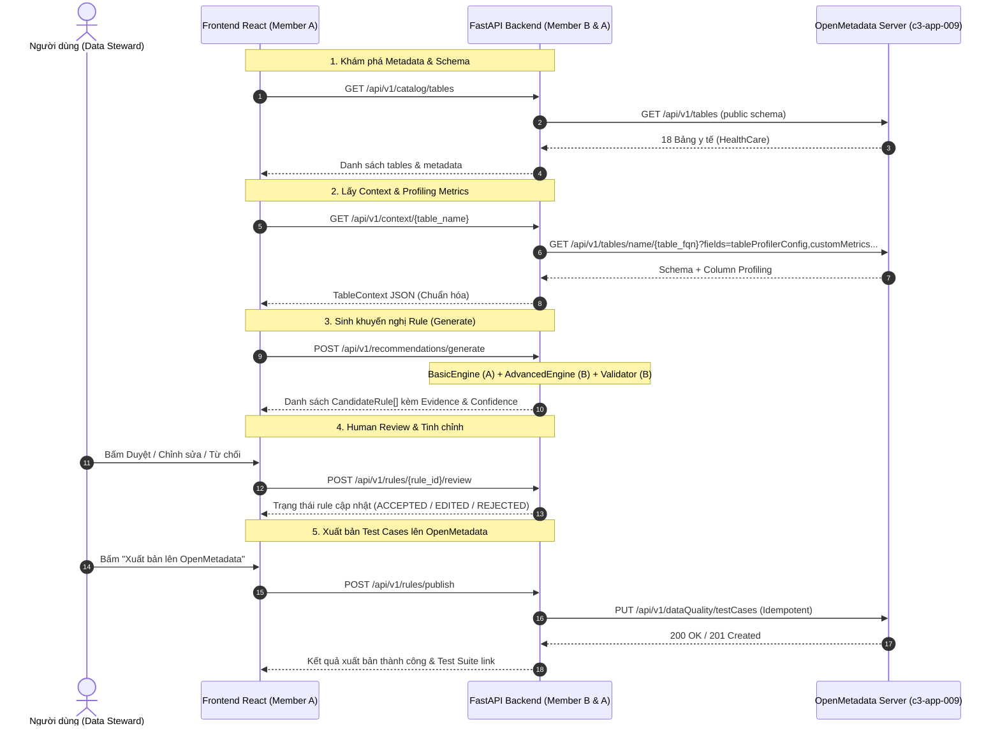

# TÀI LIỆU API CONTRACT DÀNH CHO FRONTEND - BACKEND
**Dự án:** Data Quality Rule Recommender & Observability Platform (Tích hợp OpenMetadata)  
**Phiên bản API:** `v2.0.0`  
**Base URL:** `http://localhost:8000/api/v1`  
**Định dạng dữ liệu:** `application/json; charset=utf-8`  
**CORS Policy:** Đã cấu hình cho phép Frontend (`http://localhost:5173` và `*`)

---

## 1. TỔNG QUAN KIẾN TRÚC & PHÂN CHIA TRÁCH NHIỆM

Hệ thống hoạt động theo mô hình tích hợp hai chiều giữa Web UI (Thành viên A) và Backend/OpenMetadata Engine (Thành viên B):



### Phân công trách nhiệm giữa 2 thành viên:
- **Thành viên A:** Toàn quyền `frontend/`, client gọi API `frontend/src/services/openmetadataService.js`, thuật toán `backend/engine/basic_engine.py`, giao diện Human Review và báo cáo UI.
- **Thành viên B:** Quản trị kết nối cơ sở dữ liệu (Postgres), module xây dựng Context & Profiler (`backend/integrations/openmetadata_client.py`), động cơ `backend/engine/advanced_engine.py` (LLM / SQL Cross-column), bộ thẩm định `backend/validator/` (Dedup, Conflict), và module đẩy Test Case `backend/integrations/openmetadata_publisher.py`.

---

## 2. DANH SÁCH CHI TIẾT CÁC ENDPOINT API

### NHÓM 1: KIỂM TRA HỆ THỐNG & KẾT NỐI (SYSTEM & HEALTH)

#### 1.1 `GET /api/v1/health`
- **Mục đích:** FE gọi định kỳ khi khởi động hoặc render Header để xác định trạng thái Backend và kiểm tra xem Backend có ping được tới OpenMetadata Server hay không.
- **Request:**
  - Headers: Không yêu cầu
  - Query Params: Không có
- **Response Success (200 OK):**
```json
{
  "status": "healthy",
  "openmetadata_connected": true,
  "openmetadata_url": "https://c3-app-009.duckdns.org/api/v1"
}
```
- **Response Khi Mất Kết Nối OpenMetadata (200 OK):**
```json
{
  "status": "healthy",
  "openmetadata_connected": false,
  "openmetadata_url": "https://c3-app-009.duckdns.org/api/v1"
}
```

---

### NHÓM 2: KHÁM PHÁ CATALOG METADATA (OPENMETADATA EXPLORER)

#### 2.1 `GET /api/v1/catalog/services`
- **Mục đích:** Lấy danh sách Database Services được tích hợp trên OpenMetadata.
- **Response (200 OK):**
```json
{
  "services": [
    {
      "id": "e4f8d212-0001-4c12-98ab-123456789abc",
      "name": "healthcare_postgres",
      "fullyQualifiedName": "healthcare_postgres",
      "serviceType": "Postgres",
      "description": "PostgreSQL database chứa 18 bảng dữ liệu bệnh nhân và y tế"
    }
  ]
}
```

#### 2.2 `GET /api/v1/catalog/databases`
- **Mục đích:** Lấy danh sách database thuộc service được chọn.
- **Query Params:**
  - `service` (string, optional, mặc định: `"healthcare_postgres"`)
- **Response (200 OK):**
```json
{
  "databases": [
    {
      "id": "a1b2c3d4-db01-4433-a123-bcde12345678",
      "name": "HealthCare",
      "fullyQualifiedName": "healthcare_postgres.HealthCare",
      "description": "Database hồ sơ bệnh án điện tử"
    }
  ]
}
```

#### 2.3 `GET /api/v1/catalog/schemas`
- **Mục đích:** Lấy danh sách schemas thuộc database.
- **Query Params:**
  - `databaseFqn` (string, optional, mặc định: `"healthcare_postgres.HealthCare"`)
- **Response (200 OK):**
```json
{
  "schemas": [
    {
      "id": "f5e4d3c2-sc01-4422-9988-aabbccddeeff",
      "name": "public",
      "fullyQualifiedName": "healthcare_postgres.HealthCare.public",
      "description": "Public schema chứa 18 bảng nghiệp vụ"
    }
  ]
}
```

#### 2.4 `GET /api/v1/catalog/tables`
- **Mục đích:** Lấy danh sách toàn bộ 18 bảng dữ liệu trong schema. FE dùng để đổ vào thanh điều hướng bên trái và thanh tìm kiếm.
- **Query Params:**
  - `schemaFqn` (string, optional, mặc định: `"healthcare_postgres.HealthCare.public"`)
- **Response (200 OK):**
```json
{
  "tables": [
    {
      "id": "3e9b1f23-d8a1-43e8-8a0b-111111111111",
      "name": "patients",
      "fullyQualifiedName": "healthcare_postgres.HealthCare.public.patients",
      "displayName": "Patients (Bệnh nhân)",
      "description": "Thông tin nhân khẩu học và hồ sơ bệnh nhân",
      "columns_count": 14,
      "row_count": 1000
    },
    {
      "id": "7a8c2d34-e9b2-44f9-9b1c-222222222222",
      "name": "encounters",
      "fullyQualifiedName": "healthcare_postgres.HealthCare.public.encounters",
      "displayName": "Encounters (Lượt khám)",
      "description": "Lịch sử các đợt khám và điều trị nội/ngoại trú",
      "columns_count": 12,
      "row_count": 2500
    }
  ]
}
```

#### 2.5 `GET /api/v1/catalog/tables/{table_id_or_name}`
- **Mục đích:** Lấy raw metadata thực tế của bảng từ OpenMetadata (gồm đầy đủ JSON schema, tags, owner, custom metrics).
- **Path Param:** `table_id_or_name` (string, bắt buộc) - ID hoặc tên bảng (vd: `patients`).
- **Response (200 OK):** Đối tượng Table Entity nguyên bản của OpenMetadata.

---

### NHÓM 3: ĐẶC TẢ BẢNG & ĐO LƯỜNG CHẤT LƯỢNG (TABLE CONTEXT & PROFILING)

#### 3.1 `GET /api/v1/tables`
- **Mục đích:** Endpoint rút gọn trả về danh sách bảng cho Quick Selector trên thanh Header / Toolbar.
- **Response (200 OK):**
```json
{
  "tables": [
    {
      "id": "patients",
      "name": "patients",
      "fullyQualifiedName": "healthcare_postgres.HealthCare.public.patients",
      "columns_count": 14,
      "row_count": 1000
    }
  ]
}
```

#### 3.2 `GET /api/v1/context/{table_name}`
- **Mục đích:** Lấy đối tượng chuẩn hóa `TableContext` phục vụ render màn hình Schema, màn hình Profiling Metrics, và làm đầu vào cho Rule Recommendation Engine.
- **Path Param:** `table_name` (string, bắt buộc) - Tên bảng (vd: `patients`, `encounters`, `conditions`, ...).
- **Response (200 OK - Model `TableContext`):**
```json
{
  "datasource_id": "openmetadata",
  "database_name": "HealthCare",
  "schema_name": "public",
  "table_name": "patients",
  "table_description": "Thông tin chi tiết về nhân khẩu học và hồ sơ y tế bệnh nhân",
  "row_count": 1000,
  "tier": "Tier.Tier2",
  "domain": "Healthcare Operations",
  "owner": {
    "name": "admin",
    "type": "user"
  },
  "tags": [
    { "tagFQN": "PersonalData.Personal", "source": "Classification" }
  ],
  "columns": [
    {
      "name": "id",
      "data_type": "VARCHAR",
      "nullable": false,
      "description": "Định danh duy nhất (UUID) của bệnh nhân",
      "is_primary_key": true,
      "is_foreign_key": false,
      "profile": {
        "row_count": 1000,
        "null_count": 0,
        "null_ratio": 0.0,
        "distinct_count": 1000,
        "distinct_ratio": 1.0,
        "min_value": null,
        "max_value": null,
        "min_length": 36,
        "max_length": 36,
        "top_values": []
      }
    },
    {
      "name": "gender",
      "data_type": "VARCHAR",
      "nullable": false,
      "description": "Giới tính bệnh nhân (M/F)",
      "is_primary_key": false,
      "is_foreign_key": false,
      "profile": {
        "row_count": 1000,
        "null_count": 0,
        "null_ratio": 0.0,
        "distinct_count": 2,
        "distinct_ratio": 0.002,
        "min_value": "F",
        "max_value": "M",
        "min_length": 1,
        "max_length": 1,
        "top_values": [
          {"value": "M", "count": 512},
          {"value": "F", "count": 488}
        ]
      }
    }
  ],
  "existing_rules": []
}
```

---

### NHÓM 4: SINH KHUYẾN NGHỊ LUẬT CHẤT LƯỢNG (RECOMMENDATION ENGINE)

#### 4.1 `POST /api/v1/recommendations/generate`
- **Mục đích:** Khi người dùng bấm nút **"Sinh khuyến nghị (Generate Rules)"** trên UI:
  1. Backend nạp `TableContext` từ OpenMetadata.
  2. Kích hoạt `BasicRuleEngine` (do Thành viên A viết) sinh Heuristic rules.
  3. Kích hoạt `AdvancedRuleEngine` (do Thành viên B viết) sinh LLM / Cross-column rules.
  4. Chạy qua `RuleValidator` (do Thành viên B viết) lọc trùng lặp và xung đột.
  5. Trả về danh sách `CandidateRule[]` hiển thị thành các Card trên UI.
- **Request Body (JSON):**
```json
{
  "table_name": "patients",
  "datasource_id": "openmetadata",
  "engines": ["BASIC", "ADVANCED"]
}
```
| Tham số | Kiểu dữ liệu | Bắt buộc | Ý nghĩa |
| :--- | :--- | :--- | :--- |
| `table_name` | string | Có | Tên bảng cần sinh luật (vd: `patients`) |
| `datasource_id` | string | Không | Mã nguồn dữ liệu (mặc định: `"openmetadata"`) |
| `engines` | string[] | Không | Danh sách engine kích hoạt (`["BASIC"]`, `["ADVANCED"]`, hoặc cả hai) |

- **Response (200 OK):**
```json
{
  "table_name": "patients",
  "row_count": 1000,
  "total_rules": 6,
  "rules": [
    {
      "id": "rule_a1b2c3d4",
      "rule_type": "columnValuesToBeNotNull",
      "description": "Cột không được để trống (Not Null)",
      "target_columns": ["id"],
      "parameters": {},
      "expression": null,
      "engine": "BASIC",
      "confidence": 1.0,
      "reason": "Dữ liệu thực tế có 0/1000 giá trị null (0.0%). Cột mang tính toàn vẹn cao.",
      "evidence": {
        "null_count": 0,
        "null_ratio": 0.0,
        "total_rows": 1000
      },
      "validation_status": "VALID",
      "validation_message": null,
      "status": "DRAFT",
      "edited_parameters": null,
      "created_at": "2026-10-04T16:00:00Z"
    },
    {
      "id": "rule_e5f6g7h8",
      "rule_type": "columnValuesToBeInSet",
      "description": "Giá trị phải thuộc tập hợp cố định (In Set)",
      "target_columns": ["gender"],
      "parameters": {
        "allowedValues": ["M", "F"]
      },
      "expression": null,
      "engine": "BASIC",
      "confidence": 0.95,
      "reason": "Cột có số lượng giá trị phân biệt thấp (2/1000), phù hợp ràng buộc miền giá trị chuẩn hóa.",
      "evidence": {
        "distinct_count": 2,
        "distinct_ratio": 0.002,
        "top_values": [{"value": "M", "count": 512}, {"value": "F", "count": 488}],
        "total_rows": 1000
      },
      "validation_status": "VALID",
      "validation_message": null,
      "status": "DRAFT",
      "edited_parameters": null,
      "created_at": "2026-10-04T16:00:00Z"
    },
    {
      "id": "rule_adv_pat_001",
      "rule_type": "tableCustomSQLQuery",
      "description": "Ràng buộc tử vong: Ngày mất (deathdate) phải sau ngày sinh (birthdate)",
      "target_columns": ["birthdate", "deathdate"],
      "parameters": {
        "sqlExpression": "deathdate IS NULL OR deathdate >= birthdate"
      },
      "expression": null,
      "engine": "ADVANCED",
      "confidence": 0.98,
      "reason": "Logic thời gian y tế: Thời điểm mất (deathdate) phải sau hoặc trùng với thời điểm sinh (birthdate).",
      "evidence": {
        "sample_violations_count": 0,
        "total_rows": 1000
      },
      "validation_status": "VALID",
      "validation_message": null,
      "status": "DRAFT",
      "edited_parameters": null,
      "created_at": "2026-10-04T16:00:00Z"
    }
  ]
}
```

---

### NHÓM 5: QUY TRÌNH DUYỆT HUMAN REVIEW

#### 5.1 `POST /api/v1/rules/{rule_id}/review`
- **Mục đích:** Xử lý tương tác của người dùng trên thẻ Rule Card:
  - Bấm **"Chấp thuận (Accept)"** $\rightarrow$ Đổi trạng thái sang `ACCEPTED`.
  - Bấm **"Từ chối (Reject)"** $\rightarrow$ Đổi trạng thái sang `REJECTED`.
  - Bấm **"Chỉnh sửa (Edit)"** $\rightarrow$ Cập nhật tham số mới vào `edited_parameters` và đổi trạng thái sang `EDITED`.
- **Path Param:** `rule_id` (string, bắt buộc) - ID của luật đang tương tác.
- **Request Body (JSON):**
```json
{
  "action": "EDITED",
  "edited_parameters": {
    "minValue": 0,
    "maxValue": 120
  },
  "comment": "Điều chỉnh biên tuổi phù hợp với nghiên cứu lâm sàng"
}
```
| Trường | Kiểu dữ liệu | Giá trị hợp lệ | Ý nghĩa |
| :--- | :--- | :--- | :--- |
| `action` | string | `"ACCEPTED"`, `"REJECTED"`, `"EDITED"` | Quyết định của người duyệt |
| `edited_parameters` | object | null hoặc object dict | Chứa các tham số đã sửa (chỉ gửi khi `action == "EDITED"`) |
| `comment` | string | null hoặc string | Ghi chú lý do của Data Steward |

- **Response Success (200 OK):**
```json
{
  "message": "Đã cập nhật rule rule_a1b2c3d4 thành EDITED",
  "rule": {
    "id": "rule_a1b2c3d4",
    "rule_type": "columnValuesToBeBetween",
    "status": "EDITED",
    "edited_parameters": {
      "minValue": 0,
      "maxValue": 120
    }
  }
}
```
- **Response Lỗi (404 Not Found):**
```json
{
  "detail": "Không tìm thấy Rule với ID này"
}
```

---

### NHÓM 6: XUẤT BẢN TEST CASES LÊN OPENMETADATA (PUBLISH TEST CASES)

#### 6.1 `POST /api/v1/rules/publish`
- **Mục đích:** Đẩy toàn bộ các rule đã được người dùng phê duyệt (`ACCEPTED` hoặc `EDITED`) lên máy chủ OpenMetadata thực tế để giám sát tự động.
- **Backend xử lý (Trách nhiệm Thành viên B):**
  - Tạo hoặc lấy `TestSuite` tương ứng với bảng.
  - Sử dụng phương thức **`PUT /api/v1/dataQuality/testCases`** để đảm bảo tính **Idempotent** (ghi đè an toàn, không sinh lỗi `409 Conflict` nếu test case đã tồn tại).
- **Request Body (JSON):**
```json
{
  "table_name": "patients",
  "rule_ids": ["rule_a1b2c3d4", "rule_adv_pat_001"],
  "rules": [
    {
      "id": "rule_a1b2c3d4",
      "rule_type": "columnValuesToBeNotNull",
      "description": "Cột không được để trống (Not Null)",
      "target_columns": ["id"],
      "parameters": {},
      "engine": "BASIC",
      "status": "ACCEPTED"
    }
  ]
}
```
> *Lưu ý: FE hỗ trợ gửi danh sách object `rules` đầy đủ hoặc chỉ mảng `rule_ids`. Backend sẽ ưu tiên duyệt các rule có trạng thái `ACCEPTED` hoặc `EDITED`.*

- **Response Success (200 OK):**
```json
{
  "success": true,
  "message": "Đã xuất bản thành công 4 test cases lên OpenMetadata!",
  "published_count": 4,
  "test_suite_id": "a9e102f4-7128-40ea-9bb2-123456789abc",
  "published_test_cases": [
    {
      "rule_id": "rule_a1b2c3d4",
      "test_case_name": "patients_id_columnValuesToBeNotNull",
      "test_definition": "columnValuesToBeNotNull",
      "column_name": "id",
      "status": "PUBLISHED",
      "openmetadata_id": "8fa12345-0001-4444-aaaa-bbbbccccdddd"
    },
    {
      "rule_id": "rule_adv_pat_001",
      "test_case_name": "patients_tableCustomSQLQuery",
      "test_definition": "tableCustomSQLQuery",
      "column_name": null,
      "status": "PUBLISHED",
      "openmetadata_id": "8fa12345-0002-4444-aaaa-bbbbccccdddd"
    }
  ],
  "failed_rules": []
}
```

---

### NHÓM 7: BÁO CÁO ĐÁNH GIÁ CHẤT LƯỢNG (EVALUATION BENCHMARK)

#### 7.1 `GET /api/v1/evaluation/summary`
- **Mục đích:** FE hiển thị Dashboard Đánh giá & Kiểm nghiệm (Mục 27 LLD) chứng minh độ bao phủ (Coverage) và độ an toàn (Safety) trên toàn bộ 18 bảng dataset y tế.
- **Response (200 OK):**
```json
{
  "benchmark_timestamp": "2026-10-04T16:04:12Z",
  "total_tables_evaluated": 18,
  "total_columns_evaluated": 172,
  "total_rows_evaluated": 34500,
  "rules_generated_count": 86,
  "metrics": {
    "coverage_score": 0.9535,
    "coverage_percentage": "95.35%",
    "coverage_status": "EXCELLENT",
    "safety_score": 1.0,
    "safety_percentage": "100.0%",
    "safety_error_count": 0,
    "avg_execution_latency_ms": 28.4
  },
  "tables_detail": [
    {
      "table_name": "patients",
      "columns_count": 14,
      "rules_count": 6,
      "coverage": 1.0,
      "safety_passed": true
    },
    {
      "table_name": "encounters",
      "columns_count": 12,
      "rules_count": 5,
      "coverage": 0.92,
      "safety_passed": true
    }
  ]
}
```

---

## 3. CÁC SCHEMA DỮ LIỆU CỐT LÕI (DATA CONTRACTS)

Cả hai thành viên cần tuân thủ nghiêm ngặt 2 cấu trúc Pydantic sau (tại `backend/contracts/`):

### 3.1 `CandidateRule` (`backend/contracts/candidate_rule.py`)
```python
class CandidateRule(BaseModel):
    id: str                                  # Định danh unique của rule (vd: rule_a1b2c3d4)
    rule_type: str                           # Tên loại test OpenMetadata (xem bảng mapping bên dưới)
    description: Optional[str] = None        # Mô tả tiếng Việt thân thiện với người dùng
    target_columns: List[str]                # Danh sách cột áp dụng
    parameters: Dict[str, Any] = {}          # Tham số test: minValue, maxValue, allowedValues, sqlExpression...
    expression: Optional[str] = None         # Biểu thức SQL (nếu có)
    engine: Literal["BASIC", "ADVANCED"]     # Nguồn sinh: "BASIC" (Thành viên A) hoặc "ADVANCED" (Thành viên B)
    confidence: float = 1.0                  # Độ tin cậy từ 0.0 đến 1.0
    reason: str                              # Giải thích nghiệp vụ bằng tiếng Việt
    evidence: Dict[str, Any] = {}            # Bằng chứng định lượng (null_count, distinct_count, min, max...)
    validation_status: Literal["VALID", "WARNING", "INVALID"] = "VALID"
    validation_message: Optional[str] = None # Thông báo cảnh báo của Validator
    status: Literal["DRAFT", "ACCEPTED", "EDITED", "REJECTED"] = "DRAFT"
    edited_parameters: Optional[Dict[str, Any]] = None # Tham số sau khi Data Steward chỉnh sửa
    created_at: str                          # ISO 8601 Timestamp
```

### 3.2 `TableContext` (`backend/contracts/table_context.py`)
```python
class ColumnProfile(BaseModel):
    row_count: int = 0
    null_count: int = 0
    null_ratio: float = 0.0
    distinct_count: int = 0
    distinct_ratio: float = 0.0
    min_value: Optional[Any] = None
    max_value: Optional[Any] = None
    min_length: Optional[int] = None
    max_length: Optional[int] = None
    top_values: List[Dict[str, Any]] = []

class ColumnContext(BaseModel):
    name: str
    data_type: str
    nullable: bool = True
    description: Optional[str] = None
    is_primary_key: bool = False
    is_foreign_key: bool = False
    profile: ColumnProfile = ColumnProfile()

class TableContext(BaseModel):
    datasource_id: str = "openmetadata"
    database_name: str
    schema_name: str
    table_name: str
    table_description: Optional[str] = None
    row_count: int = 0
    tier: Optional[str] = "Tier.Tier2"
    domain: Optional[str] = None
    owner: Optional[Dict[str, Any]] = None
    tags: List[Dict[str, Any]] = []
    columns: List[ColumnContext] = []
    existing_rules: List[Dict[str, Any]] = []
```

---

## 4. BẢNG ÁNH XẠ RULE TYPE VỚI OPENMETADATA TEST DEFINITION

Khi Thành viên B viết module xuất bản (`openmetadata_publisher.py`) hoặc sinh luật nâng cao (`advanced_engine.py`), các `rule_type` phải map chính xác với Test Definition có sẵn trong OpenMetadata:

| Rule Type | Cấp độ (Scope) | Ý nghĩa nghiệp vụ | Tham số trong `parameters` |
| :--- | :--- | :--- | :--- |
| `columnValuesToBeNotNull` | Cột (Column) | Cột bắt buộc không được rỗng / null | Không cần tham số `{}` |
| `columnValuesToBeUnique` | Cột (Column) | Giá trị mỗi dòng phải duy nhất (Primary/Unique Key) | Không cần tham số `{}` |
| `columnValuesToBeBetween` | Cột (Column) | Ràng buộc dải số hoặc ngày hợp lệ | `{"minValue": x, "maxValue": y}` |
| `columnValuesToBeInSet` | Cột (Column) | Giá trị phải nằm trong tập danh mục cho phép | `{"allowedValues": ["A", "B"]}` |
| `columnValueLengthsToBeBetween` | Cột (Column) | Chiều dài chuỗi ký tự hợp lệ (Mã code, UUID, SĐT) | `{"minLength": x, "maxLength": y}` |
| `tableRowCountToBeBetween` | Bảng (Table) | Số lượng bản ghi trong bảng nằm trong khoảng an toàn | `{"minValue": x, "maxValue": y}` |
| `tableCustomSQLQuery` | Bảng (Table) | Logic chéo cột / Logic miền nghiệp vụ nâng cao | `{"sqlExpression": "..."}` |

---

## 5. CHECKLIST PHỐI HỢP DÀNH CHO THÀNH VIÊN B

1. **Khởi chạy Backend:**
   ```bash
   # Chạy FastAPI Backend tại port 8000
   python -m uvicorn backend.main:app --host 127.0.0.1 --port 8000 --reload
   ```
2. **Khởi chạy Frontend Web:**
   ```bash
   # Chạy React UI tại port 5173
   npm run dev
   ```
3. **Cấu hình OpenMetadata Client:**
   - Server: `https://c3-app-009.duckdns.org/api/v1`
   - Đảm bảo token JWT còn hiệu lực trong file cấu hình `.env` hoặc `backend/config.py`.
4. **Idempotency khi Publish:**
   - Luôn sử dụng `PUT /api/v1/dataQuality/testCases` thay vì `POST` để tránh lỗi `409 Conflict` khi người dùng bấm xuất bản lại các luật đã có.
5. **Cơ sở dữ liệu (Database):**
   - Với máy tính cá nhân RAM 8GB, ưu tiên sử dụng Cloud PostgreSQL miễn phí (như Neon.tech hoặc Supabase) hoặc SQLite để tránh bị tràn bộ nhớ khi bật đồng thời IDE, trình duyệt và Docker.
