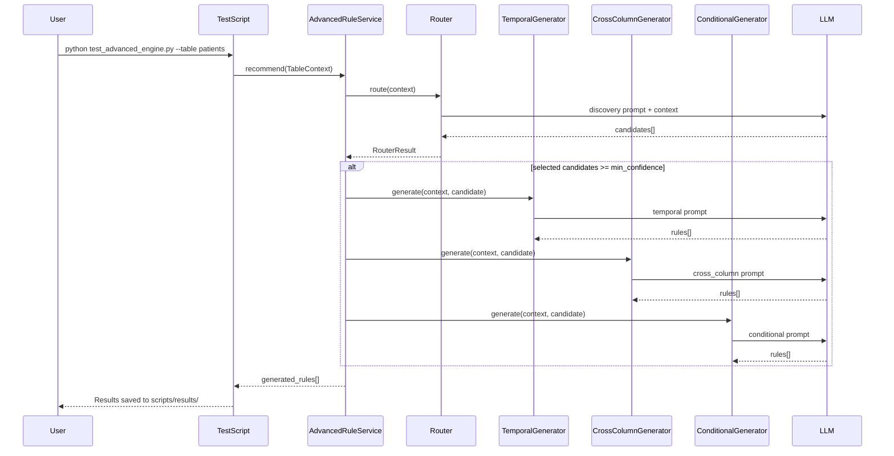

# Advanced Rule Engine - Implementation Report

## 1. Overview

Implementation of the **Advanced Data Quality Rule Engine** for automatic discovery of advanced data quality rules using LLM.

### Architecture

```
Table Context (from OpenMetadata)
    ↓
LLM Router (RouterCandidate[])
    ↓
Confidence Filter (threshold=0.6)
    ↓
Specialized Generators
├── TemporalGenerator → TEMPORAL rules
├── CrossColumnGenerator → CROSS_COLUMN rules
└── ConditionalDependencyGenerator → CONDITIONAL_DEPENDENCY rules
    ↓
Generated Rules[] (saved to results folder)
```

---

## 2. Files Created/Modified

### Core Engine

| File | Purpose |
|------|---------|
| `backend/engine/advanced_rule_service.py` | Orchestration service |
| `backend/engine/advanced_llm/client.py` | LLM client (DeepSeek/OpenAI compatible) |
| `backend/engine/advanced_llm/router.py` | Router for candidate discovery |
| `backend/engine/advanced_llm/base_generator.py` | Base generator abstraction |
| `backend/engine/advanced_llm/temporal_generator.py` | Temporal rule generator |
| `backend/engine/advanced_llm/cross_column_generator.py` | Cross-column rule generator |
| `backend/engine/advanced_llm/conditional_dependency_generator.py` | Conditional dependency generator |

### Contracts

| File | Purpose |
|------|---------|
| `backend/contracts/table_context.py` | TableContext model with constraints |
| `backend/contracts/advanced_rule_router.py` | RouterCandidate, RouterResult |
| `backend/contracts/advanced_rule.py` | GeneratedRule, GeneratorResult |
| `backend/contracts/rule_type.py` | AdvancedRuleType enum |

### Prompts

| File | Purpose |
|------|---------|
| `backend/engine/prompts/advanced_router.md` | Router prompt |
| `backend/engine/prompts/advanced_router_2.md` | Router prompt (enhanced) |
| `backend/engine/prompts/temporal.md` | Temporal generator prompt |
| `backend/engine/prompts/cross_column.md` | Cross-column generator prompt |
| `backend/engine/prompts/conditional_dependency.md` | Conditional generator prompt |

### Scripts

| File | Purpose |
|------|---------|
| `scripts/test_advanced_engine.py` | Test script for all components |
| `scripts/run_advanced_rule_pipeline.py` | Full pipeline runner |

### OpenMetadata Integration

| File | Purpose |
|------|---------|
| `backend/integrations/openmetadata/client.py` | OpenMetadata client with constraint sync |
| `backend/integrations/openmetadata/description_syncer.py` | Description sync to OM |
| `backend/integrations/openmetadata/relationship_syncer.py` | Constraint sync to OM |

---

## 3. Supported Rule Types

### 1. TEMPORAL
Time-ordering relationship between date/time columns.

**Example:**
```json
{
  "rule_type": "TEMPORAL",
  "columns": ["birthdate", "deathdate"],
  "condition": "deathdate >= birthdate",
  "confidence": 0.92
}
```

### 2. CROSS_COLUMN
Logical relationship between two or more columns.

**Example:**
```json
{
  "rule_type": "CROSS_COLUMN",
  "columns": ["healthcare_coverage", "healthcare_expenses"],
  "condition": "healthcare_coverage <= healthcare_expenses",
  "confidence": 0.9
}
```

### 3. CONDITIONAL_DEPENDENCY
IF-THEN dependency between columns.

**Example:**
```json
{
  "rule_type": "CONDITIONAL_DEPENDENCY",
  "columns": ["prefix", "gender"],
  "condition": "IF prefix = 'Mr.' THEN gender = 'M'",
  "confidence": 0.8
}
```

---

## 4. TableContext Structure

```python
TableContext:
    datasource_id: str
    database_name: str
    schema_name: str
    table_name: str
    table_description: Optional[str]
    row_count: int
    tier: Optional[str]
    domain: Optional[str]
    owner: Optional[Dict]
    tags: List[Dict]
    columns: List[ColumnContext]
    existing_rules: List[Dict]
    
    # Constraint metadata (NEW)
    primary_keys: List[str]
    foreign_keys: List[ForeignKeyInfo]

ColumnContext:
    name: str
    data_type: str
    nullable: bool
    description: Optional[str]
    is_primary_key: bool
    is_foreign_key: bool
    profile: ColumnProfile

ForeignKeyInfo (NEW):
    column_name: str
    referenced_table: str
    referenced_column: str
    constraint_name: Optional[str]
```

---

## 5. Router Input/Output Example

### Input (Router Context for `patients` table)

```json
{
  "table": {
    "name": "patients",
    "schema": "public",
    "database": "HealthCare",
    "description": "Thong tin nhan khau hoc va thong tin ca nhan cua benh nhan..."
  },
  "primary_keys": ["id"],
  "foreign_keys": [],
  "columns": [
    {
      "name": "birthdate",
      "datatype": "date",
      "nullable": true,
      "is_primary_key": false,
      "description": "Ngay sinh cua benh nhan",
      "profiling": {
        "null_ratio": 0.0,
        "distinct_ratio": 0.898,
        "min": "1930-11-06",
        "max": "2026-05-27"
      }
    },
    // ... 27 more columns
  ]
}
```

### Output (Router Candidates)

```json
{
  "candidates": [
    {
      "rule_type": "TEMPORAL",
      "relevant_columns": ["birthdate", "deathdate"],
      "confidence": 0.95,
      "reason": "Both are date columns; death date should logically be on or after birth date."
    },
    {
      "rule_type": "CONDITIONAL_DEPENDENCY",
      "relevant_columns": ["prefix", "gender"],
      "confidence": 0.9,
      "reason": "Prefix values Mr./Ms./Mrs. imply gender."
    },
    {
      "rule_type": "CROSS_COLUMN",
      "relevant_columns": ["healthcare_coverage", "healthcare_expenses"],
      "confidence": 0.65,
      "reason": "Coverage should not exceed total medical expenses."
    }
  ]
}
```

---

## 6. Generator Output Example

### Temporal Generator

**Input:** `birthdate`, `deathdate` columns

**Output:**
```json
{
  "rules": [
    {
      "rule_type": "TEMPORAL",
      "target_table": "patients",
      "columns": ["birthdate", "deathdate"],
      "condition": "deathdate >= birthdate",
      "reason": "A patient's death date cannot occur before their birth date.",
      "confidence": 0.92,
      "evidence": [
        "birthdate column description: Ngay sinh",
        "deathdate column description: Ngay mat"
      ]
    }
  ]
}
```

### Conditional Dependency Generator

**Input:** `prefix`, `gender` columns

**Output:**
```json
{
  "rules": [
    {
      "rule_type": "CONDITIONAL_DEPENDENCY",
      "columns": ["prefix", "gender"],
      "condition": "IF prefix = 'Mr.' THEN gender = 'M'",
      "confidence": 0.8
    },
    {
      "rule_type": "CONDITIONAL_DEPENDENCY",
      "columns": ["prefix", "gender"],
      "condition": "IF prefix = 'Ms.' THEN gender = 'F'",
      "confidence": 0.8
    },
    {
      "rule_type": "CONDITIONAL_DEPENDENCY",
      "columns": ["prefix", "gender"],
      "condition": "IF prefix = 'Mrs.' THEN gender = 'F'",
      "confidence": 0.8
    }
  ]
}
```

---

## 7. Configuration

### Environment Variables

```env
# LLM Configuration
LLM_API=sk-your-api-key
LLM_BASE_URL=https://api.deepseek.com
LLM_MODEL=deepseek-flash
LLM_TIMEOUT_SECONDS=120
LLM_MAX_RETRIES=3

# OpenMetadata Configuration
OM_API=https://c3-app-009.duckdns.org
OM_TOKEN=your-jwt-token

# Advanced Rule Configuration
ADVANCED_ROUTER_MIN_CONFIDENCE=0.6
```

---

## 8. Usage

### Test Individual Components

```bash
# Test router only
python scripts/test_advanced_engine.py --table patients --router-only

# Test temporal generator
python scripts/test_advanced_engine.py --table patients --temporal

# Test cross-column generator
python scripts/test_advanced_engine.py --table patients --cross-column

# Test conditional generator
python scripts/test_advanced_engine.py --table patients --conditional

# Test all components
python scripts/test_advanced_engine.py --table patients --all

# Full pipeline with results saving
python scripts/test_advanced_engine.py --table patients --min-confidence 0.6
```

### Run Full Pipeline

```bash
python scripts/run_advanced_rule_pipeline.py --table patients
```

---

## 9. Test Results

### Table: `patients` (28 columns)

| Component | Candidates | Rules Generated |
|-----------|------------|-----------------|
| Router | 4 | - |
| Temporal | 1 | 1 |
| Cross-Column | 1 | 1 |
| Conditional | 2 | 4 |
| **Total** | **4** | **6** |

### Generated Rules

1. **TEMPORAL:** `deathdate >= birthdate` (conf=0.92)
2. **CROSS_COLUMN:** `healthcare_coverage <= healthcare_expenses` (conf=0.9)
3. **CONDITIONAL:** `prefix='Mr.' → gender='M'` (conf=0.8)
4. **CONDITIONAL:** `prefix='Ms.' → gender='F'` (conf=0.8)
5. **CONDITIONAL:** `prefix='Mrs.' → gender='F'` (conf=0.8)
6. **CONDITIONAL:** `maiden IS NOT NULL → gender='F'` (conf=0.75)

---

## 10. LLM Client Configuration

```python
@dataclass
class LLMConfig:
    base_url: str = "https://api.deepseek.com"
    api_key: str = os.getenv("LLM_API", "")
    model: str = "deepseek-flash"
    timeout_seconds: float = 120.0
    max_retries: int = 3
```

**Features:**
- OpenAI-compatible API
- Structured JSON output
- Automatic retry with exponential backoff
- Pydantic validation
- Timeout handling

---

## 11. Results Output

Results are saved to `scripts/results/<table>_<component>_<timestamp>/`:

```
scripts/results/patients_router_20261006_143000/
├── router_context.json    # Input context sent to LLM
├── raw_response.json     # Raw LLM response
├── candidates.json       # Parsed candidates
└── summary.json          # Test summary with prompt file name
```

### Summary.json Example

```json
{
  "table": "patients",
  "component": "router",
  "prompt_file": "advanced_router.md",
  "candidates_count": 4,
  "columns_count": 28,
  "primary_keys": ["id"]
}
```

---

## 12. Known Limitations

1. **FK Relationships:** OpenMetadata API does not support adding FK via PATCH - manual sync or ingestion connector required
2. **Confidence Calibration:** Threshold 0.6 is empirical, not scientifically calibrated
3. **No Semantic Deduplication:** Only exact duplicate removal
4. **DeepSeek Timeout:** May need 120s timeout for complex tables
5. **Single Table:** Router processes one table at a time

---

## 13. Next Recommended Steps

1. **Add Pattern Rules** - Format/pattern detection for columns like SSN, ZIP
2. **Cross-Table Rules** - Use FK relationships to generate cross-table rules
3. **Ground Truth Evaluation** - Create evaluation dataset for precision/recall measurement
4. **API Endpoint** - Expose as REST API for integration
5. **Rule Validation** - Add statistical validation before final output

---

## 14. Mermaid Diagram



---

## 15. Prompt Files Reference

| Component | Prompt File | Purpose |
|-----------|------------|---------|
| Router | `advanced_router.md` | Discover rule candidates |
| Temporal | `temporal.md` | Generate temporal rules |
| Cross-Column | `cross_column.md` | Generate cross-column rules |
| Conditional | `conditional_dependency.md` | Generate conditional rules |

---

*Document generated: 2024-10-06*
*Implementation status: Phase 1-10 Complete*
