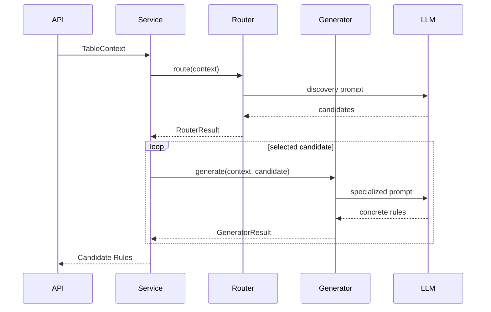

# Advanced Rule Engine — Router & Generator Implementation Plan

## 1. Goal

Implement the first usable version of the **Advanced Data Quality Rule Engine**.

The engine has exactly two main LLM stages:

```text
Table Context
    ↓
LLM Router
    ↓
Candidate Rule Types
(rule type + relevant columns + confidence)
    ↓
Confidence Filter
    ↓
Specialized Generator per selected rule type
    ↓
Concrete Candidate Rules
```

This implementation MUST NOT add extra architectural layers unless required for correctness.

For the first POC:

- Router inspects one table at a time.
- Router may return zero, one, or multiple candidate rule types.
- Router also identifies relevant columns for each candidate.
- Only rule types passing the confidence threshold are sent to generators.
- Each rule type has its own specialized generator prompt.
- All outputs MUST be structured JSON validated by Pydantic.
- No rule is automatically created in OpenMetadata in this phase.
- Output of this engine is a list of validated candidate rules ready for later validation/review.

---

# 2. Scope

## Supported Advanced Rule Types

Start with exactly these 3 types:

```text
CROSS_COLUMN
CONDITIONAL_DEPENDENCY
TEMPORAL
```

Definitions:

### CROSS_COLUMN

A logical relationship between two or more columns.

Example:

```text
total_amount = quantity * unit_price
```

### CONDITIONAL_DEPENDENCY

An IF-THEN dependency between columns.

Example:

```text
IF status = 'completed'
THEN completed_at IS NOT NULL
```

### TEMPORAL

A time-ordering relationship between date/time columns.

Example:

```text
delivery_date >= order_date
```

Do NOT implement Custom SQL generation in this phase.

Do NOT implement native OpenMetadata rule mapping in this phase.

Do NOT implement semantic search/RAG in this phase.

---

# 3. High-Level Architecture

```text
OpenMetadata / Input JSON
          ↓
      TableContext
          ↓
   AdvancedRuleService
          ↓
      LLM Router
          ↓
   RouterResult[]
          ↓
   Confidence Filter
          ↓
 ┌────────┬───────────────┬─────────┐
 ↓        ↓               ↓
Cross     Conditional     Temporal
Column    Generator       Generator
Generator
 ↓        ↓               ↓
 └────────┴───────────────┴─────────┘
          ↓
    CandidateRule[]
          ↓
     Output Validation
          ↓
     API Response
```

---

# 4. Technical Stack

Recommended:

```text
Python 3.11+
FastAPI
Pydantic v2
httpx
OpenAI-compatible LLM client abstraction
pytest
pytest-asyncio
tenacity (retry)
structlog or standard logging
```

LLM provider must be abstracted behind one client interface.

Do NOT couple router/generator code directly to a specific vendor SDK.

---


# 6. Core Data Models

## 6.1 ColumnContext

```python
from typing import Any
from pydantic import BaseModel, Field

class ColumnContext(BaseModel):
    name: str
    datatype: str
    description: str | None = None
    profiling: dict[str, Any] | None = None
    tags: list[str] = []
    glossary_terms: list[str] = []
```

Profiling may contain:

```json
{
  "null_ratio": 0.12,
  "distinct_ratio": 0.85,
  "min": 0,
  "max": 100,
  "top_values": [
    {"value": "completed", "ratio": 0.45}
  ]
}
```

Do not require every field.

---

## 6.2 TableContext

```python
class TableContext(BaseModel):
    table_name: str
    table_description: str | None = None
    columns: list[ColumnContext]

    relationships: list[dict] = []
    existing_rules: list[dict] = []
    constraints: list[dict] = []

    domain: str | None = None
```

The Router receives one `TableContext`.

---

# 7. Router Output Contract

## 7.1 RuleType Enum

```python
from enum import Enum

class AdvancedRuleType(str, Enum):
    CROSS_COLUMN = "CROSS_COLUMN"
    CONDITIONAL_DEPENDENCY = "CONDITIONAL_DEPENDENCY"
    TEMPORAL = "TEMPORAL"
```

## 7.2 RouterCandidate

```python
class RouterCandidate(BaseModel):
    rule_type: AdvancedRuleType
    relevant_columns: list[str] = Field(min_length=1)
    confidence: float = Field(ge=0.0, le=1.0)
    reason: str
```

## 7.3 RouterResult

```python
class RouterResult(BaseModel):
    candidates: list[RouterCandidate]
```

Example:

```json
{
  "candidates": [
    {
      "rule_type": "TEMPORAL",
      "relevant_columns": ["order_date", "delivery_date"],
      "confidence": 0.93,
      "reason": "Both columns represent ordered lifecycle timestamps."
    },
    {
      "rule_type": "CONDITIONAL_DEPENDENCY",
      "relevant_columns": ["status", "completed_at"],
      "confidence": 0.86,
      "reason": "Completion state may determine whether completed_at is required."
    }
  ]
}
```

Router MUST be allowed to return:

```json
{"candidates": []}
```

when no Advanced Rule is reasonably supported.

---

# 8. Router Responsibilities

Router performs ONLY rule discovery.

Router must answer:

```text
Which supported advanced rule types may exist in this table?
Which columns are relevant to each candidate?
How confident is the discovery?
Why is this candidate worth deeper analysis?
```

Router MUST NOT generate concrete conditions such as:

```text
delivery_date >= order_date
```

or:

```text
IF status='completed' THEN completed_at IS NOT NULL
```

Those belong to generators.

---

# 9. Router Input Construction

Build a compact prompt context.

Provide:

```text
TABLE
- name
- description
- domain if available

COLUMNS
For each column:
- name
- datatype
- description
- lightweight profiling

RELATIONSHIPS
- if available

EXISTING CONSTRAINTS
- if available

SUPPORTED ADVANCED RULE TYPES
- CROSS_COLUMN
- CONDITIONAL_DEPENDENCY
- TEMPORAL
```

Do NOT send raw sample rows in Router POC.

Do NOT send full existing data values.

---

# 10. Router Prompt Specification

Create:

```text
app/prompts/router.md
```

Prompt requirements:

```text
You are a Data Quality Rule Discovery Router.

Your task is ONLY to identify which supported advanced Data Quality rule
types may be relevant for the provided table.

You MUST NOT generate the actual business rule or SQL.

Supported rule types:

1. CROSS_COLUMN
   A logical relationship between two or more columns.

2. CONDITIONAL_DEPENDENCY
   An IF-THEN dependency between columns.

3. TEMPORAL
   A time-ordering relationship between date/time columns.

For each candidate:
- select one supported rule type;
- list only the columns relevant to that candidate;
- provide a confidence score between 0 and 1;
- provide a short evidence-based reason.

You may return ZERO, ONE, or MULTIPLE candidates.

Do not create a candidate unless there is reasonable evidence from:
- column names;
- datatype;
- descriptions;
- profiling;
- relationships;
- existing constraints.

Do not infer a business rule only because current data happens to exhibit a pattern.

Do not output unsupported rule types.

Return valid JSON only using the provided schema.
```

Append serialized `TableContext`.

---

# 11. Router LLM Call

Implement:

```python
class AdvancedRuleRouter:

    async def route(
        self,
        context: TableContext
    ) -> RouterResult:
        ...
```

Processing:

```text
1. Load router prompt
2. Serialize compact TableContext
3. Call LLM client
4. Require JSON response
5. Parse using RouterResult
6. Validate column names
7. Return RouterResult
```

---

# 12. Router Post-Validation

For every candidate:

1. `rule_type` must be in `AdvancedRuleType`.
2. Every `relevant_columns` value must exist in `TableContext.columns`.
3. Remove duplicate columns.
4. Remove exact duplicate candidates.
5. Sort candidates by confidence descending.

If Router returns a nonexistent column, reject that candidate.

---

# 13. Confidence Filtering

Add config:

```env
ADVANCED_ROUTER_MIN_CONFIDENCE=0.75
```

Implementation:

```python
selected_candidates = [
    c for c in router_result.candidates
    if c.confidence >= settings.advanced_router_min_confidence
]
```

Important:

The threshold is a POC routing threshold, not a scientifically calibrated probability.

Log below-threshold candidates for later evaluation.

---

# 14. Generator Architecture

Each selected RouterCandidate is sent to exactly one specialized generator.

```python
GENERATOR_REGISTRY = {
    AdvancedRuleType.CROSS_COLUMN: CrossColumnGenerator,
    AdvancedRuleType.CONDITIONAL_DEPENDENCY: ConditionalDependencyGenerator,
    AdvancedRuleType.TEMPORAL: TemporalGenerator,
}
```

---

# 15. Generator Input Contract

Generator receives:

```text
TableContext
+
RouterCandidate
```

Before sending to LLM:

- filter columns to `RouterCandidate.relevant_columns`;
- include table description;
- include full metadata/profiling only for selected columns;
- include relationships involving selected columns;
- include existing rules involving selected columns.

Do NOT send unrelated columns unless needed for table meaning.

---

# 16. Generator Output Contract

Use one canonical output model.

```python
class GeneratedRule(BaseModel):
    rule_type: AdvancedRuleType
    target_table: str
    columns: list[str]
    condition: str
    reason: str
    confidence: float = Field(ge=0.0, le=1.0)
    evidence: list[str] = []
```

Response wrapper:

```python
class GeneratorResult(BaseModel):
    rules: list[GeneratedRule]
```

A generator MUST be allowed to return:

```json
{"rules": []}
```

if deeper analysis finds insufficient evidence.

Router candidate does not guarantee a valid final rule.

---

# 17. Cross-Column Generator

Files:

```text
app/llm/generators/cross_column.py
app/prompts/cross_column.md
```

Task: generate logical relationships between selected columns.

Examples:

```text
total_amount = quantity * unit_price
discount_amount <= total_amount
```

Prompt constraints:

```text
- use only provided columns;
- do not generate single-column rules;
- do not invent undocumented business logic;
- return no rule if evidence is weak;
- explain evidence briefly;
- JSON only.
```

Interface:

```python
class CrossColumnGenerator:

    async def generate(
        self,
        context: TableContext,
        candidate: RouterCandidate
    ) -> GeneratorResult:
        ...
```

---

# 18. Conditional Dependency Generator

Files:

```text
app/llm/generators/conditional_dependency.py
app/prompts/conditional_dependency.md
```

Task: generate IF-THEN constraints.

Examples:

```text
IF status = 'completed'
THEN completed_at IS NOT NULL
```

```text
IF payment_method = 'card'
THEN card_transaction_id IS NOT NULL
```

Do not guess enum values unless supported by profiling, glossary, description, or documented constraint.

---

# 19. Temporal Generator

Files:

```text
app/llm/generators/temporal.py
app/prompts/temporal.md
```

Task: generate time-ordering constraints.

Examples:

```text
delivery_date >= order_date
end_time >= start_time
discharge_date >= admission_date
```

Only create rules supported by semantic meaning.

---

# 20. Base Generator

Implement common interface:

```python
from abc import ABC, abstractmethod

class BaseRuleGenerator(ABC):

    @abstractmethod
    async def generate(
        self,
        context: TableContext,
        candidate: RouterCandidate
    ) -> GeneratorResult:
        ...
```

Common helper responsibilities:

```text
load prompt
build filtered generator context
call LLM
parse JSON
Pydantic validation
validate returned columns
normalize output
```

---

# 21. LLM Client Abstraction

Implement:

```python
class LLMClient:

    async def generate_structured(
        self,
        system_prompt: str,
        user_prompt: str,
        response_model: type[BaseModel]
    ) -> BaseModel:
        ...
```

Requirements:

- configurable model;
- configurable base URL;
- configurable API key;
- timeout;
- retry;
- structured output / JSON mode when supported;
- no business logic inside client.

Environment:

```env
LLM_BASE_URL=
LLM_API_KEY=
LLM_MODEL=
LLM_TIMEOUT_SECONDS=30
LLM_MAX_RETRIES=2
```

---

# 22. Retry Strategy

Retry only for:

```text
timeout
429
5xx
invalid JSON
temporary provider failure
```

Do not endlessly retry hallucinated business content.

Recommended:

```text
max attempts = 2 or 3
exponential backoff
```

If JSON is invalid, allow one strict repair retry.

---

# 23. AdvancedRuleService

Implement orchestration in:

```text
app/services/advanced_rule_service.py
```

Pseudo-code:

```python
class AdvancedRuleService:

    async def recommend(
        self,
        context: TableContext
    ) -> list[GeneratedRule]:

        router_result = await self.router.route(context)

        selected = [
            c for c in router_result.candidates
            if c.confidence >= self.min_confidence
        ]

        all_rules = []

        for candidate in selected:
            generator = self.generator_registry[candidate.rule_type]

            result = await generator.generate(
                context=context,
                candidate=candidate
            )

            all_rules.extend(result.rules)

        return self._deduplicate(all_rules)
```

For first implementation, run generator calls sequentially.

After POC works, optionally compare with parallel calls using `asyncio.gather`.

---

# 24. API Endpoint

Create:

```text
POST /api/v1/advanced-rules/recommend
```

Request:

```json
{
  "table_name": "orders",
  "table_description": "Stores customer orders",
  "columns": [
    {
      "name": "order_date",
      "datatype": "TIMESTAMP",
      "description": "Time when the order was created",
      "profiling": {"null_ratio": 0.0}
    },
    {
      "name": "delivery_date",
      "datatype": "TIMESTAMP",
      "description": "Time when the order was delivered",
      "profiling": {"null_ratio": 0.10}
    }
  ]
}
```

Response:

```json
{
  "router": {
    "candidates": [
      {
        "rule_type": "TEMPORAL",
        "relevant_columns": ["order_date", "delivery_date"],
        "confidence": 0.93,
        "reason": "Related lifecycle timestamps."
      }
    ]
  },
  "selected_candidates": [
    {
      "rule_type": "TEMPORAL",
      "relevant_columns": ["order_date", "delivery_date"],
      "confidence": 0.93
    }
  ],
  "generated_rules": [
    {
      "rule_type": "TEMPORAL",
      "target_table": "orders",
      "columns": ["order_date", "delivery_date"],
      "condition": "delivery_date >= order_date",
      "reason": "Delivery should not occur before order creation.",
      "confidence": 0.91,
      "evidence": [
        "order_date description",
        "delivery_date description"
      ]
    }
  ]
}
```

Keep router output visible in POC for debugging/evaluation.

---

# 25. Logging

Log per request:

```text
request_id
table_name
router_candidate_count
router_candidates
selected_candidate_count
generator_calls
generated_rule_count
router_latency_ms
generator_latency_ms
total_latency_ms
token usage if available
```

Do NOT log credentials or sensitive raw samples.

---

# 26. Error Handling

## Router failure

Do not call generators.

Return controlled error:

```json
{"error": "ROUTER_FAILED"}
```

## One generator failure

Do not necessarily fail the whole request.

Return successful rules plus warning:

```json
{
  "warnings": [
    {
      "rule_type": "CONDITIONAL_DEPENDENCY",
      "error": "GENERATOR_FAILED"
    }
  ]
}
```

---

# 27. Deduplication

Normalize by:

```text
rule_type
+
sorted columns
+
normalized condition
```

Remove exact duplicates only in POC.

Do not implement semantic deduplication yet.

---

# 28. Unit Tests — Router

Required tests:

1. One temporal candidate.
2. Multiple candidates.
3. No advanced rule.
4. LLM returns nonexistent column.
5. Unsupported rule type.
6. Duplicate candidate.
7. Below-threshold candidate.

Use mocked LLM responses.

---

# 29. Unit Tests — Generators

For each generator test:

```text
valid output
empty output
invalid column
invalid JSON
unsupported rule type
confidence out of range
```

---

# 30. Integration Test

Build a realistic `orders` table:

```text
order_id
order_date
delivery_date
status
completed_at
quantity
unit_price
total_amount
```

Mocked Router output:

```text
TEMPORAL
CONDITIONAL_DEPENDENCY
CROSS_COLUMN
```

Mocked generator outputs:

```text
delivery_date >= order_date
```

```text
IF status = 'completed'
THEN completed_at IS NOT NULL
```

```text
total_amount = quantity * unit_price
```

Do NOT hard-code these production rules.

---

# 31. Real LLM Evaluation Set

Create:

```text
tests/evaluation/router_cases.json
```

Initial target:

```text
10–20 tables
```

Each case:

```json
{
  "table_context": {},
  "expected_rule_types": [
    "TEMPORAL",
    "CONDITIONAL_DEPENDENCY"
  ]
}
```

---

# 32. Router Evaluation

Primary metric:

```text
Router Recall
=
correct expected rule types selected
/
all expected rule types
```

Also measure Router Precision.

Router Recall is especially important because a missed route prevents the corresponding generator from ever running.

---

# 33. Generator Evaluation

For each rule type measure:

```text
Rule Precision
Semantic Correctness
Invalid Output Rate
Empty Output Rate
```

Use manually prepared ground truth for POC.

Do not treat LLM confidence as calibrated probability yet.

---

# 34. POC Experiment

Compare:

## Baseline A — Call all generators

```text
Table
→ Cross-column Generator
→ Conditional Generator
→ Temporal Generator
```

## Proposed B — Router first

```text
Table
→ Router
→ Selected Generators
```

Measure:

```text
rule precision
rule recall
router recall
LLM calls/table
token usage
latency
```

Goal:

```text
Verify whether Router reduces calls/noise without unacceptable recall loss.
```

---

# 35. Security

Requirements:

```text
do not send raw sensitive rows by default
do not log prompt bodies in production
mask sample values if sample support is later added
store LLM credentials in environment/secret manager
```

Treat metadata descriptions as untrusted input.

---

# 36. Implementation Order for Codex

Codex should implement in this order.

## Phase 1 — Models

Implement:

```text
ColumnContext
TableContext
AdvancedRuleType
RouterCandidate
RouterResult
GeneratedRule
GeneratorResult
```

Add validation tests.

## Phase 2 — LLM Client

Implement provider-independent structured LLM client.

Add timeout, retry, JSON parsing, and Pydantic validation.

Use fake/mock client in unit tests.

## Phase 3 — Router

Implement:

```text
router prompt
AdvancedRuleRouter
router post-validation
confidence filtering
```

Tests must pass before continuing.

## Phase 4 — Cross-Column Generator

Implement first generator and verify the common abstraction.

## Phase 5 — Conditional Generator

Implement.

## Phase 6 — Temporal Generator

Implement.

## Phase 7 — AdvancedRuleService

Wire:

```text
Router
→ Confidence Filter
→ Generator Registry
→ Sequential Generator Calls
→ Deduplication
```

## Phase 8 — API

Expose recommendation endpoint.

## Phase 9 — Integration Tests

Add mocked end-to-end test.

## Phase 10 — Real LLM Smoke Test

Run on a small table set and record results.

---

# 37. Definition of Done

- [ ] Router accepts one complete table context.
- [ ] Router supports multi-label output.
- [ ] Router returns rule type + relevant columns + confidence + reason.
- [ ] Router can return no candidates.
- [ ] Router output is Pydantic validated.
- [ ] Invalid/nonexistent columns are rejected.
- [ ] Confidence threshold controls generator invocation.
- [ ] CROSS_COLUMN generator works.
- [ ] CONDITIONAL_DEPENDENCY generator works.
- [ ] TEMPORAL generator works.
- [ ] Generator input contains only relevant context.
- [ ] Generator may return zero rules.
- [ ] All generator outputs use one canonical schema.
- [ ] Generator registry is implemented.
- [ ] Generator calls run sequentially in first POC.
- [ ] One generator failure does not destroy successful outputs from others.
- [ ] API exposes Router result and Generated Rules for POC debugging.
- [ ] Unit tests pass.
- [ ] Mocked integration test passes.
- [ ] Real LLM smoke test can run from configuration.
- [ ] Router Recall can be measured on evaluation fixtures.

---

# 38. Explicit Non-Goals

Codex MUST NOT implement these in this task unless required for compatibility with existing code:

```text
Candidate Column Selector
Embedding retrieval
Vector DB
Semantic Search
RAG
Custom SQL Generator
OpenMetadata Test Case creation
Human Review UI
Rule execution
Basic Rule Engine
Fine-tuning
Autonomous agent framework
```

The architecture must remain:

```text
Table Context
→ LLM Router
→ Confidence Filter
→ Specialized Generator Calls
→ Candidate Rules
```

---

# 39. Required Codex Report After Implementation

After coding, Codex must create:

```text
docs/advanced_rule_engine_implementation_report.md
```

Include:

1. Files created/modified.
2. Final module architecture.
3. Router input/output example.
4. Generator input/output example.
5. Structured output validation.
6. Confidence filtering.
7. Error/retry behavior.
8. Test results.
9. Known limitations.
10. Next recommended step.

Also include a Mermaid sequence diagram:



---

# 40. Final Technical Principle

Keep the responsibility boundary strict:

```text
Router:
"What kinds of advanced rules may exist, and which columns are relevant?"

Generator:
"What is the concrete rule for this selected type and selected columns?"
```

Do not merge these responsibilities in the first POC.

This separation is required so Router and Generator quality can be evaluated independently.
